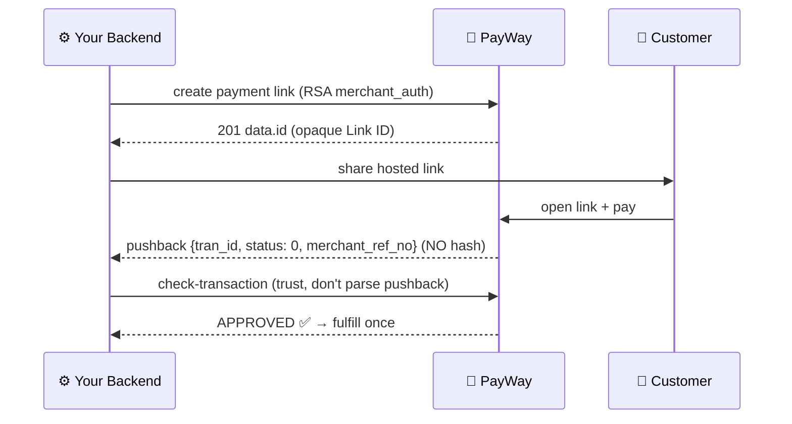

# Competitive Portal-Parity Implementation Plan

> **For agentic workers:** REQUIRED SUB-SKILL: Use superpowers:subagent-driven-development (recommended) or superpowers:executing-plans to implement this plan task-by-task. Steps use checkbox (`- [ ]`) syntax for tracking.

**Goal:** Implement the four adoptable items from the Canadia competitive audit so our docs/SDK match the portal-polish bar it set.

**Architecture:** All four items are additive docs/CLI surface. The error registry treats the existing typed TS maps (`src/cli/explain-code.ts`, `src/constants.ts`) as the single source of truth and generates a versioned JSON artifact from them (drift-guarded by a test) rather than introducing a parallel hand-maintained JSON. The docs acceptance bar is a vitest file that pins per-chapter structure (sequence diagram + code block + link health) so quality regresses loudly. Gallery images are captured once from the sandbox via a committed script (branded templates are gateway-rendered; offline QR cannot produce them).

**Tech Stack:** TypeScript, commander (CLI), vitest, tsx (scripts), Mermaid (GitHub-native rendering).

**Spec:** `docs/competitive-analysis-canadia.md` — sections "What Canadia does better" (items 1, 2, 3, 5, 6) and "Competitive opportunities" (P0 ×2, P1 ×2).

## Global Constraints

- Node ≥22.12. In the worktree: `npm ci && npm run build` BEFORE any vitest run (build-before-test footgun).
- Suite green after every task: `npm run build && npx vitest run` (~1660 tests baseline). Sandbox-contract test stays excluded (default `npm test`).
- `scripts/check-package-contents.mjs` forbids `src/` and `docs/` inside the npm package — `docs/error-codes.json` + gallery PNGs are repo artifacts only; no new runtime npm deps.
- Diagrams: GitHub-native Mermaid, no `%%{init}` directives, follow `docs/diagrams/` conventions (emoji participants, `alt/par` with ✅/❌, `Note` annotations).
- Never write real ABA merchant credentials/values into docs, tests, or PNG metadata. Placeholders only (`SANDBOX_MERCHANT` style).
- Work only inside the campaign worktree; no merges/pushes without the user (concurrent-agents rule).

**Decisions taken (defaults, reversible):** work happens in a NEW worktree off `main` (branch `feat/competitive-portal-parity`) because the main checkout sits on `feat/customer-module-qr` with another agent's uncommitted work. Gallery images are captured via 7 real sandbox `generate-qr` calls. Merge-back is user-gated.

---

### Task 0: Worktree + plan doc

- [ ] `git worktree add ../SDK-prepration-cparity -b feat/competitive-portal-parity main`
- [ ] `npm ci && npm run build && npx vitest run` → baseline green; record the count
- [ ] Commit the plan doc: `docs: competitive portal-parity implementation plan`

### Task 1: Error provenance + `explain --json` (TDD)

**Files:**
- Modify: `src/cli/explain-code.ts` (interface at :15-20; add map near :100), `src/cli.ts:1306-1331` (explain action)
- Test: `src/__tests__/cli-inprocess.test.ts` (helpers `run()`/`captureConsole()` at :37-47, explain tests :58-99)

**Interfaces:**
- Produces: `CodeExplanation` gains `readonly sandboxVerified?: boolean; readonly evidence?: string;`; new export `SANDBOX_VERIFIED_EVIDENCE: Record<string, string>`; explain command accepts `--json`.

- [ ] **Step 1: Write the failing test** (add to cli-inprocess.test.ts):

```ts
it('explain --json prints one JSON doc; unknown code prints the error envelope', async () => {
  await run(['explain', 'PTL36', '--json']);
  const doc = JSON.parse(captured.stdout);
  expect(doc).toMatchObject({ code: 'PTL36', family: 'refund', sandboxVerified: true });
  expect(doc.evidence).toMatch(/SANDBOX-FINDINGS §/);
  await run(['explain', 'NOPE-1', '--json']);
  expect(JSON.parse(captured.stdout).error.kind).toBe('validation');
  expect(process.exitCode).toBe(1);
});
```

- [ ] **Step 2: Run to verify fail** — `npx vitest run src/__tests__/cli-inprocess.test.ts` → new cases FAIL (`--json` unknown option / missing fields).
- [ ] **Step 3: Implement** in `src/cli/explain-code.ts`:

```ts
/** Codes live-verified against the sandbox; values are evidence pointers. */
export const SANDBOX_VERIFIED_EVIDENCE: Record<string, string> = {
  '1': 'SANDBOX-FINDINGS §6', '2': 'SANDBOX-FINDINGS §21', '5': 'SANDBOX-FINDINGS §8',
  '8': 'SANDBOX-FINDINGS §6', '12': 'SANDBOX-FINDINGS §9', '26': 'SANDBOX-FINDINGS §6',
  '32': 'SANDBOX-FINDINGS §22', '37': 'SANDBOX-FINDINGS §9', '49': 'SANDBOX-FINDINGS §8',
  '96': 'SANDBOX-FINDINGS §22/§23', '429': 'SANDBOX-FINDINGS §11', '04': 'SANDBOX-FINDINGS §13',
  '09': 'SANDBOX-FINDINGS §16', '104': 'SANDBOX-FINDINGS §16', '105': 'SANDBOX-FINDINGS §16',
  PTL02: 'SANDBOX-FINDINGS §6/§9', PTL04: 'SANDBOX-FINDINGS §9/§22', PTL36: 'SANDBOX-FINDINGS §8/§9',
  PTL59: 'SANDBOX-FINDINGS §9', PTL62: 'SANDBOX-FINDINGS §6/§9', PTL170: 'SANDBOX-FINDINGS §9',
  PTL188: 'SANDBOX-FINDINGS §23',
};

function withProvenance(e: CodeExplanation): CodeExplanation {
  const ev = SANDBOX_VERIFIED_EVIDENCE[e.code];
  return ev ? { ...e, sandboxVerified: true, evidence: ev } : e;
}
```

Wrap every return of `explainPayWayCode()` (:120-166) and every push in `explainAll()` (:169-204) with `withProvenance(...)`. In `src/cli.ts` explain action add `.option('--json', 'machine-readable output')`: bare → `console.log(JSON.stringify(explainAll(), null, 2))`; known code → single object; unknown → envelope `{ error: { kind: 'validation', exitCode: 1, message } }` + `process.exitCode = 1`. Keep the `Using profile:` diagnostic on STDERR under `--json` (existing F11 convention).
- [ ] **Step 4: Run to verify pass** — `npx vitest run src/__tests__/cli-inprocess.test.ts src/__tests__/error-parity-b5.test.ts` → PASS (fields additive; existing text tests unchanged).
- [ ] **Step 5: Commit** — `git add src/cli/explain-code.ts src/cli.ts src/__tests__/cli-inprocess.test.ts && git commit -m "feat: explain --json + sandbox-verified provenance on error codes"`

### Task 2: Registry generator + `docs/error-codes.json` + drift guard (TDD)

**Files:**
- Create: `scripts/generate-error-registry.ts`, `docs/error-codes.json`
- Modify: `package.json` (script `gen:error-registry` = `tsx scripts/generate-error-registry.ts`)
- Test: `src/__tests__/error-registry.test.ts`

**Interfaces:**
- Consumes: `explainAll()` from Task 1.
- Produces: schema `{ "registryVersion": 1, "generated": "<ISO>", "source": "src/cli/explain-code.ts", "codes": CodeExplanation[] }`, codes sorted by `family` then `code` (`localeCompare` with `{ numeric: true }`).

- [ ] **Step 1: Failing test:**

```ts
import { readFileSync } from 'node:fs';
import { join, dirname } from 'node:path';
import { fileURLToPath } from 'node:url';
import { explainAll } from '../cli/explain-code.js';

const here = dirname(fileURLToPath(import.meta.url));
const load = () => JSON.parse(readFileSync(join(here, '..', '..', 'docs', 'error-codes.json'), 'utf8'));
const expected = () => [...explainAll()].sort((a, b) =>
  a.family.localeCompare(b.family) || a.code.localeCompare(b.code, undefined, { numeric: true }));

it('docs/error-codes.json stays in sync with explainAll()', () => {
  const reg = load();
  expect(reg.registryVersion).toBe(1);
  expect(reg.codes).toEqual(expected());
});

it('registry marks live-verified codes with SANDBOX-FINDINGS evidence', () => {
  const verified = load().codes.filter((c) => c.sandboxVerified);
  expect(verified.length).toBeGreaterThanOrEqual(20);
  for (const c of verified) expect(c.evidence).toMatch(/^SANDBOX-FINDINGS §/);
});
```

- [ ] **Step 2: Run → FAIL** (file missing).
- [ ] **Step 3: Generator** — `scripts/generate-error-registry.ts` imports `explainAll` from `../src/cli/explain-code.js`, sorts identically, writes `docs/error-codes.json` via `fileURLToPath(new URL('../docs/error-codes.json', import.meta.url))` with `JSON.stringify(payload, null, 2) + '\n'`. Add the npm script; run `npm run gen:error-registry`.
- [ ] **Step 4: Run → PASS.** Commit: `feat: generated error-code registry (docs/error-codes.json) + drift guard`

### Task 3: Registry docs + skills sync

**Files:**
- Modify: `docs/12-error-handling-and-debugging.md` (new `### Machine-readable registry` after the explain section ~:359), `docs/README.md`, `skills/aba-payway-agent/SKILL.md` (:266-277 output-shape pin)

- [ ] docs/12: registry path, regen command `npm run gen:error-registry`, field table (`code/family/title/hint/sandboxVerified/evidence`), note that the drift test enforces sync.
- [ ] Agent skill: extend the pinned explain output example with `"sandboxVerified": true, "evidence": "SANDBOX-FINDINGS §8/§9"` plus one line: sandboxVerified = live-verified against the sandbox; other codes are spec-derived.
- [ ] docs/README.md: index `docs/error-codes.json`.
- [ ] `npx vitest run src/__tests__/docs-examples.test.ts` → PASS (skill pins + README link check). Commit: `docs: error-code registry surface in docs/12, README, agent skill`

### Task 4: Acceptance-bar test (write RED; committed green in Task 7)

**Files:**
- Create: `src/__tests__/docs-acceptance-bar.test.ts` (reuse the repoRoot/readDoc helper pattern from docs-examples.test.ts:14-26)

**Interfaces:**
- Produces: `FLOW_CHAPTERS: string[]` — the enforced chapter list (grows over time): `['03-web-implementation.md','04-native-app-implementation.md','05-webview-implementation.md','06-telegram-mini-app.md','07-qr-code-handling.md','08-deep-linking.md','11-callbacks-and-webhooks.md','17-payment-link.md']`

```ts
const read = (p: string) => readFileSync(join(repoRoot, 'docs', p), 'utf8');
const mermaidBlocks = (md: string) => [...md.matchAll(/```mermaid\n([\s\S]*?)```/g)].map((m) => m[1]);

it.each(FLOW_CHAPTERS)('%s carries an inline payment-flow sequence diagram', (ch) => {
  const blocks = mermaidBlocks(read(ch));
  expect(blocks.length).toBeGreaterThanOrEqual(1);
  expect(blocks.join('\n')).toContain('sequenceDiagram');
});

it('every numbered guide chapter carries at least one example code block', () => {
  const chapters = readdirSync(join(repoRoot, 'docs')).filter((f) => /^\d{2}-.*\.md$/.test(f));
  expect(chapters.length).toBeGreaterThanOrEqual(18);
  expect(chapters.filter((f) => !/```/.test(read(f)))).toEqual([]);
});

it('diagram-library files are linked from their canonical chapters and docs/README.md', () => {
  expect(read('03-web-implementation.md')).toContain('diagrams/payment-lifecycle.md');
  expect(read('11-callbacks-and-webhooks.md')).toContain('diagrams/callback-flow.md');
  expect(read('01-overview-and-concepts.md')).toContain('diagrams/platform-decision-tree.md');
  expect(read('09-link-unlink-renew-lifecycle.md')).toContain('diagrams/link-unlink-state-machine.md');
  expect(read('README.md')).toContain('Diagram library');
});
```

- [ ] Run → FAIL (chapters lack mermaid; links missing). Do not commit until green (Tasks 5-7).

### Task 5: Sequence diagrams — chapters 03/04/05/06

**Files:** Modify each chapter — insert `## Flow at a glance` + one mermaid `sequenceDiagram` near the top, per docs/diagrams conventions.

Flows to author:
- **03** Browser→Backend (checkout request); Backend→PayWay (signed purchase payload); PayWay-->>Backend 200; Backend-->>Browser (hidden auto-submit form); Browser→PayWay (POST purchase, payment_gate=0); par: return-URL redirect ✅ / server callback + verifyCallback ✅; Note: fulfill once, webhook is source of truth.
- **04** App→Backend (create checkout); Backend-->>App (checkout URL); App→PayWay (WebView load); PayWay-->>App (redirect to returnURL); App→Backend (status poll); Backend-->>App (verified result); Note: intercept return-URL prefix.
- **05** Host App→Backend; Backend-->>Host artifact; Host→WebView load; alt: JS bridge postMessage ✅ / URL intercept ✅ / deeplink return ✅; Note: cookie/session rules.
- **06** Telegram Mini App→Backend (initData + order); Backend→PayWay purchase; Backend-->>TG artifact; PayWay-->>Backend callback; Backend-->>Telegram bot notification (tg.sendData) ✅.

- [ ] `npx vitest run src/__tests__/docs-acceptance-bar.test.ts -t 'sequence diagram'` → 4/8 pass.
- [ ] Commit: `docs: flow sequence diagrams for chapters 03-06`

### Task 6: Sequence diagrams — 07/08/11/17 + orphan links + README

- **07** par: online (Backend→PayWay generateQr →qrString+qrImage →Customer scans →poll/check-transaction) vs offline (Backend renders `khqr.generateOfflineQR` locally →Customer scans any bank app →PayWay POSTs `/aba-payway-khqr-webhook` NO hash → verify via check-transaction ✅).
- **08** App→Backend purchase(`abapay_khqr_deeplink`, returnDeeplink); Backend-->>App deeplink; App→ABA Pay `abapay://` launch; alt installed ✅ returns via returnDeeplink / not installed ❌ fallback URL; App→Backend verify status.
- **11** PayWay→Endpoint POST callback + `X-PAYWAY-HMAC-SHA512`; Endpoint verifyCallbackDetailed timing-safe ✅ / mismatch ❌ 403; dedupe by tran_id; alt KHQR pushback (no hash) → check-transaction before trusting ✅; fulfill once.
- **17** full reference diagram:



- [ ] Cross-links: docs/03→`diagrams/payment-lifecycle.md`, docs/11→`diagrams/callback-flow.md`, docs/01→`diagrams/platform-decision-tree.md`, docs/09→`diagrams/link-unlink-state-machine.md`; docs/README.md new "Diagram library" section listing all four files (they are currently orphaned).
- [ ] Bar test: 8/8 diagram cases + library-links case PASS.
- [ ] Commit: `docs: flow sequence diagrams 07/08/11/17 + link diagram library`

### Task 7: Turn the bar green + link coverage

- [ ] Extend the link-resolution `it.each` (docs-examples.test.ts:83) to iterate ALL `docs/NN-*.md` chapters (readdirSync at module scope); fix any broken relative links it surfaces.
- [ ] Commit Task 4's test file (now green) + this change: `test: docs acceptance bar — per-flow diagrams, code blocks, link resolution`.
- [ ] Full suite: `npm run build && npx vitest run` → green.

### Task 8: QR template gallery — capture script + sandbox run

**Files:**
- Create: `scripts/capture-qr-template-gallery.ts`, `docs/images/qr-templates/<template>.png` ×7, `docs/images/qr-templates/README.md` (manifest: template → tran_id + capture date, no secrets)

**Interfaces:**
- Consumes: `QR_TEMPLATES`/`QR_TEMPLATE_NAMES` (src/constants.ts:261-274), SDK `payway.qr.generateQr` with `qrImageTemplate`, sandbox credentials via PAYWAY_* env (two-var enablement), `NODE_TLS_REJECT_UNAUTHORIZED='0'` scoped to the command only.

- [ ] Script: loop bare template names (strip the `(default)` display label); for each `await payway.qr.generateQr({ amount: 5.0, currency: 'USD', lifetime: 360, qrImageTemplate: t })`; decode `res.qrImage` base64 → `writeFileSync(join('docs/images/qr-templates', t + '.png'), buf)`; log tran_id per template; skip existing PNGs unless `--force`.
- [ ] Run once: `$env:NODE_TLS_REJECT_UNAUTHORIZED='0'; npx tsx scripts/capture-qr-template-gallery.ts` → 7 branded PNGs; spot-check 2-3 in a viewer.
- [ ] Commit: `feat: QR template gallery capture script + sandbox-rendered samples`
- **Fallback if sandbox creds unavailable:** ship the script + text-only gallery (Task 9 minus PNG assertions); flag in the final report.

### Task 9: Gallery docs section + assertions

**Files:**
- Modify: `docs/07-qr-code-handling.md` (new `## QR Image Template Gallery` after "Using PayWay's Pre-rendered Image" ~:130), `docs/10-ui-customization.md:32` pointer
- Test: `src/__tests__/docs-acceptance-bar.test.ts`

- [ ] Gallery section: per-template image + style + use-case rows, from `QR_TEMPLATES` hints (constants.ts:261-269) + SANDBOX-FINDINGS per-template notes (:75-81, :105-111): template1 = unbranded/compact POS; template2 = default white card + ABA logo; template2_color = brand color; template3_color = compact color; template4/4_color = tall receipt (thermal printing). Note: templates are gateway-rendered (online generateQr only — offline KHQR cannot be branded); `template2` is the API default.
- [ ] docs/10 table: add "Rendered samples: see the [template gallery](./07-qr-code-handling.md#qr-image-template-gallery)".
- [ ] Test:

```ts
it('QR template gallery documents all sandbox-verified templates with images', () => {
  const md = read('07-qr-code-handling.md');
  for (const t of ['template1','template1_color','template2','template2_color','template3_color','template4','template4_color'])
    expect(md).toContain(t);
  expect(md).toContain('## QR Image Template Gallery');
  const pngs = readdirSync(join(repoRoot, 'docs', 'images', 'qr-templates')).filter((f) => f.endsWith('.png'));
  expect(pngs.sort()).toEqual(['template1.png','template1_color.png','template2.png','template2_color.png','template3_color.png','template4.png','template4_color.png']);
});
```

- [ ] Suite green. Commit: `docs: QR template gallery with sandbox-rendered samples (docs/07)`

### Task 10: Flutter docs example + citations

**Files:**
- Create: `docs/examples/flutter/payment_screen.dart`
- Modify: docs/05 (platform table row :17 + new `### Flutter (webview_flutter)` subsection with the "Full runnable example" callout pattern from docs/03:526 → `./examples/flutter/payment_screen.dart`), docs/04 (one-line callout after the Android section), docs/08 (returnDeeplink pointer)
- Test: `src/__tests__/docs-acceptance-bar.test.ts`

- [ ] Example — header comment per android/ios convention (See Chapter 5 — WebView Implementation and Chapter 8 — Deep Linking; `Dependencies: webview_flutter ^4.x, url_launcher ^6.x`), three configurable constants matching PaymentActivity.kt:33-36 (`backendCheckoutUrl`, `backendStatusUrl`, `returnUrlPrefix`), then a complete `PaymentScreen` StatefulWidget: `WebViewController` loads `backendCheckoutUrl`; `setNavigationDelegate` intercepts URLs starting with `returnUrlPrefix` → completes a `paymentCompleted` callback (success/fail parsed from query params) and pops; `launchAbapayDeeplink(deeplink, fallbackUrl)` helper using `canLaunchUrl`/`launchUrl(mode: LaunchMode.externalApplication)` with fallback per docs/08:153; status fetch from `backendStatusUrl`. NO credentials anywhere.
- [ ] Test:

```ts
it('Flutter example demonstrates webview payment + deeplink return, credential-free', () => {
  const dart = readFileSync(join(repoRoot, 'docs', 'examples', 'flutter', 'payment_screen.dart'), 'utf8');
  for (const s of ['webview_flutter', 'url_launcher', 'NavigationDelegate', 'returnUrlPrefix', 'launchUrl']) expect(dart).toContain(s);
  expect(dart).not.toMatch(/(?:merchant_?[iI]d|apiKey|API_KEY)\s*[:=]\s*['"][^'"]{8,}/);
  expect(read('05-webview-implementation.md')).toContain('examples/flutter/payment_screen.dart');
});
```

- [ ] Suite green (link test covers the new relative link). Commit: `docs: Flutter webview payment example with deeplink return (docs/examples/flutter)`

### Task 11: Final verification + bookkeeping

- [ ] `npm run build && npx vitest run` full green; `npm run check:package` green (registry JSON + PNGs must NOT appear in the tarball; skills count still 32).
- [ ] `CHANGELOG.md` Unreleased: `explain --json`, sandbox-verified provenance, generated error-code registry, docs acceptance bar, QR template gallery, Flutter example. Confirm docs/README.md indexes registry + gallery + flutter example.
- [ ] Commit: `chore: competitive portal-parity wave — changelog + verification`
- [ ] STOP — report branch state to the user; merge to main is user-gated (no merges unless told).

## Self-Review

- **Spec coverage:** audit P0-1 (registry) → Tasks 1-3; P0-2 (diagrams + acceptance bar) → Tasks 4-7; P1 gallery → Tasks 8-9; P1 Flutter → Task 10. Registry extends the existing `explain` command rather than duplicating it. "Generated" diagrams = hand-authored Mermaid enforced by test (GitHub renders natively; a diagram-generation pipeline is YAGNI).
- **Type consistency:** `CodeExplanation` fields, `SANDBOX_VERIFIED_EVIDENCE`, registry schema, `QR_TEMPLATE_NAMES` usage, and bar-test helper names are consistent across tasks.
- **Risks:** sandbox capture needs credentials in env (fallback defined in Task 8); concurrent-agent isolation via worktree; the bar test only pins chapters in `FLOW_CHAPTERS` (list grows over time).
