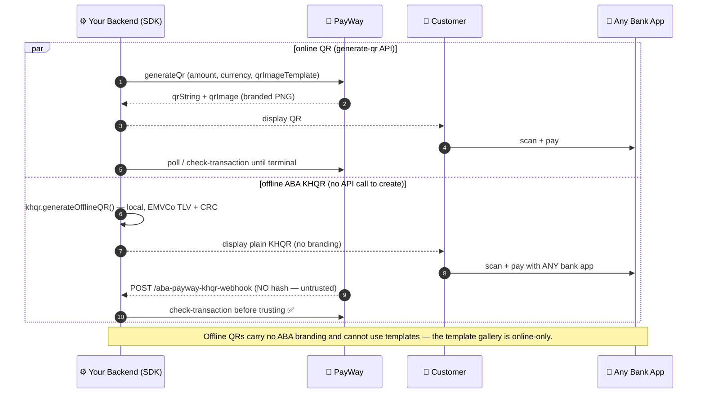

<!-- GENERATED STUB: copy of docs/guides/07-qr-code-handling.md for compatibility. Do not edit here. -->

# Chapter 7 — QR Code Handling

> **Estimated reading time:** 15 minutes
> **Goal:** Generate and display KHQR QR codes for customers to scan and pay with their banking app.

## Flow at a glance



---

## QR String vs. QR Image — Understanding the Difference

When using the PayWay QR API, you get two related but distinct pieces of data:

| Field | Format | Purpose |
|---|---|---|
| **`qrString`** | Raw text string | The actual data encoded in the QR code. Can be used by any QR library to generate a custom QR image. Also used for deep linking on mobile. |
| **`qrImage`** | Base64-encoded PNG | A pre-rendered QR code image from PayWay. Display directly in an `` tag without any QR generation library. |

> 💡 **`qrString`** is the data; **`qrImage`** is the visual. Use `qrImage` for quick display, or `qrString` if you want to customize the QR appearance.

---

## Generating a QR Code via API

The QR API endpoint generates a KHQR-compatible QR code that works with **all Cambodian banking apps** (ABA Pay, ACLEDA, etc.), not just ABA Pay.

### Fast manual CLI path

If you are testing the QR flow from the terminal instead of wiring your own backend first:

```bash
payway-sdk doctor
payway-sdk generate-qr -a 3.31 -c USD
payway-sdk check-transaction -t <id>
payway-sdk transaction-detail -t <id>
```

- `doctor` confirms credentials and online-QR callback readiness.
- `generate-qr` saves the QR PNG by default to `payway-output/<transaction-id>.png` and opens it in your OS default image viewer (interactive terminals only — scripts/agents are never interrupted).
- Use `--save-image <path>` to choose a different output path.
- Use `--no-save-image` to disable the default PNG write for one run.
- Use `--open-image` to force the viewer open regardless of environment, or `--no-open-image` to never open it.
- If `PAYWAY_CALLBACK_URL` is missing locally, run `payway-sdk setup-webhook --tunnel`.

### Backend Endpoint

```typescript
// routes/qr.ts
import { Router } from 'express';
import { payway } from '../config/payway';

const router = Router();

/**
 * POST /api/qr/generate
 *
 * Generates a KHQR QR code for the customer to scan.
 * This is an API-based flow — no browser redirect involved.
 */
router.post('/generate', async (req, res) => {
  try {
    const transactionId = `qr-${Date.now()}-${Math.random().toString(36).substring(2, 8)}`;

    // Generate QR code via PayWay API
    const qrResult = await payway.qr.generateQr({
      // Unique transaction ID for this QR (required)
      transactionId,

      // Amount the customer should pay (required)
      amount: req.body.amount, // e.g., 1.50

      // Payment option: 'abapay_khqr' for KHQR (required)
      paymentOption: 'abapay_khqr',

      // Currency: 'USD' or 'KHR'
      currency: req.body.currency || 'USD',

      // Your webhook callback URL where PayWay sends confirmation
      // ⚠️ Must be a publicly accessible HTTPS URL (use ngrok in development)
      callbackUrl: `${process.env.BASE_URL}/api/payway-webhook`,

      // QR image visual template (optional)
      // 'template1', 'template2', etc. — affects the visual style
      qrImageTemplate: 'template2',

      // ── Live-documented optional params (v1.3.6+, all also CLI flags) ──
      // Payer identity improves the scan-to-pay UX in the ABA app:
      firstName: req.body.firstName,   // --first-name
      lastName: req.body.lastName,     // --last-name
      email: req.body.email,           // --email
      phone: req.body.phone,           // --phone
      // Line items shown on the ABA app payment sheet:
      items: req.body.items,           // --items  [{name, price, quantity}]
      // Open the ABA app directly after a scan instead of a hosted page:
      returnDeeplink: req.body.returnDeeplink, // --return-deeplink
      // Echoed back verbatim in the callback (order metadata):
      customFields: req.body.customFields,    // --custom-fields
      returnParams: req.body.returnParams,    // --return-params
      // Split the collected amount at payment time ({account, amount} keys
      // here — the QR domain's shape, NOT the purchase path's {acc, amt}):
      payout: req.body.payout,               // --payout
    });

    // The response contains:
    // - qrResult.qrString: Raw QR data string
    // - qrResult.qrImage: Base64-encoded PNG image of the QR code

    res.json({
      success: true,
      transactionId,
      // Pass both to the frontend
      qrString: qrResult.qrString,
      // qrImage can be displayed directly: 
      qrImage: qrResult.qrImage,
    });
  } catch (error) {
    console.error('QR generation failed:', error);
    res.status(500).json({
      success: false,
      error: 'Failed to generate QR code. Please try again.',
    });
  }
});

export default router;
```

> 📝 **Note on callback URL:** Unlike the checkout flow (which uses both return URL and callback URL), the QR API flow relies entirely on the **callback URL** (webhook) for confirmation. There's no browser redirect in QR payments — the customer scans with their banking app and completes payment there.

---

## Displaying the QR Code on the Frontend

### Using PayWay's Pre-rendered Image (Simplest)

```html
<!-- qr-display.html -->
<!DOCTYPE html>
<html lang="en">
<head>
  <meta charset="UTF-8">
  <meta name="viewport" content="width=device-width, initial-scale=1.0">
  <title>Scan to Pay</title>
  <style>
    body {
      font-family: -apple-system, BlinkMacSystemFont, 'Segoe UI', sans-serif;
      display: flex; justify-content: center; align-items: center;
      min-height: 100vh; margin: 0; background: #f7f7f8;
    }
    .card {
      background: white; border-radius: 12px; padding: 40px;
      box-shadow: 0 1px 3px rgba(0,0,0,0.08); max-width: 420px;
      text-align: center;
    }
    .qr-container {
      border: 2px solid #e5e7eb; border-radius: 12px;
      padding: 20px; margin: 20px 0; display: inline-block;
      background: white;
    }
    .qr-container img {
      display: block; max-width: 250px; height: auto;
    }
    .amount { font-size: 2rem; font-weight: 700; margin: 10px 0; }
    .label { color: #5a5a5f; font-size: 0.875rem; }
    .app-list {
      display: flex; gap: 8px; justify-content: center;
      flex-wrap: wrap; margin-top: 16px;
    }
    .app-badge {
      background: #f7f7f8; border: 1px solid #e5e7eb;
      border-radius: 8px; padding: 6px 12px; font-size: 12px;
    }
    .expiry { color: #d97706; font-size: 0.8rem; margin-top: 16px; }
    .spinner {
      border: 3px solid #e5e7eb; border-top: 3px solid #111;
      border-radius: 50%; width: 40px; height: 40px;
      animation: spin 0.8s linear infinite; margin: 20px auto;
    }
    @keyframes spin { 0% { transform: rotate(0deg); } 100% { transform: rotate(360deg); } }
  </style>
</head>
<body>
  <div class="card">
    <h1>Scan to Pay</h1>
    <div class="amount" id="displayAmount">$15.00</div>
    <div class="label">USD</div>

    <div id="qrLoader" class="spinner"></div>

    <!-- QR Code will be inserted here -->
    <div id="qrContainer" class="qr-container" style="display: none;">
      
    </div>

    <p class="label">Open your banking app and scan this QR code</p>

    <div class="app-list">
      <span class="app-badge">ABA Pay</span>
      <span class="app-badge">ACLEDA</span>
      <span class="app-badge">Bakong</span>
      <span class="app-badge">Any Bank</span>
    </div>

    <div id="status" class="expiry"></div>
  </div>

  <script>
    async function generateQR() {
      try {
        // Call backend to generate QR code
        const response = await fetch('/api/qr/generate', {
          method: 'POST',
          headers: { 'Content-Type': 'application/json' },
          body: JSON.stringify({
            amount: 15.00,
            currency: 'USD',
          }),
        });

        const data = await response.json();

        if (!data.success) {
          throw new Error(data.error);
        }

        // Hide loader, show QR code
        document.getElementById('qrLoader').style.display = 'none';
        document.getElementById('qrContainer').style.display = 'inline-block';

        // Display the pre-rendered QR image from PayWay
        // PayWay returns the image as Base64-encoded PNG without the data URI prefix
        document.getElementById('qrImage').src = `data:image/png;base64,${data.qrImage}`;
        document.getElementById('displayAmount').textContent = `$${15.00}`;

        // Optional: store transaction ID for status polling
        window._transactionId = data.transactionId;
        document.getElementById('status').textContent = 'QR code is valid. Waiting for payment...';

        // Start polling payment status every 3 seconds
        startPolling(data.transactionId);
      } catch (error) {
        document.getElementById('qrLoader').style.display = 'none';
        document.getElementById('status').innerHTML = `
          <span style="color: #dc2626;">Error: ${error.message}</span>
          <br><button onclick="location.reload()" style="
            margin-top: 12px; padding: 8px 16px; border: none;
            border-radius: 6px; background: #111; color: white; cursor: pointer;
          ">Retry</button>
        `;
      }
    }

    /**
     * Polls the backend every 3 seconds to check if the payment was completed.
     * Stops polling when payment is confirmed.
     *
     * Note: This is a fallback for user experience. The primary confirmation
     * comes from the webhook callback (Chapter 11).
     */
    async function startPolling(transactionId) {
      const pollInterval = setInterval(async () => {
        try {
          const response = await fetch('/api/checkout/status', {
            method: 'POST',
            headers: { 'Content-Type': 'application/json' },
            body: JSON.stringify({ transactionId }),
          });

          const data = await response.json();

          if (data.status === '0' || data.status === 0) {
            // Payment confirmed!
            clearInterval(pollInterval);
            document.getElementById('status').innerHTML =
              '<span style="color: #16a34a;">✅ Payment received! Thank you.</span>';
            document.getElementById('qrContainer').style.opacity = '0.3';

            // Redirect to success page after short delay
            setTimeout(() => {
              window.location.href = `/order-confirmation?tran_id=${transactionId}`;
            }, 2000);
          }
        } catch (error) {
          // Silently continue polling — don't show errors to the user
          console.error('Poll error:', error);
        }
      }, 3000); // Poll every 3 seconds
    }

    // Start the QR generation on page load
    generateQR();
  </script>
</body>
</html>
```

---

## QR Image Template Gallery

The `qrImageTemplate` parameter (CLI `--template`) asks the **gateway** to render `qrImage` in one of seven styles. All seven are verified in sandbox (2026-08-30; per-template latency and acceptance notes in SANDBOX-FINDINGS). `template2` is the API default. Templates are online-only — the [offline ABA KHQR](#official-aba-khqr-offline-generation-no-api-call-required) pipeline produces plain unbranded EMVCo payloads and cannot carry a template.

Rendered samples (captured from the sandbox by `scripts/capture-qr-template-gallery.ts`):

| Template | Sample | Style | Use it for |
|---|---|---|---|
| `template1` | !template1 | Classic black & white card, no branding | Minimal digital displays, embedded devices, custom-branding hosts |
| `template1_color` | !template1_color | Classic layout with ABA brand color | Same as template1 with recognizable ABA mark |
| `template2` *(default)* | !template2 | White card with ABA logo header | General checkout pages |
| `template2_color` | !template2_color | Default layout with brand color | Checkout pages that match an ABA-branded theme |
| `template3_color` | !template3_color | Compact color design | Customer-facing screens where vertical space is tight |
| `template4` | !template4 | Tall receipt style, black & white | Receipts and printed invoices (thermal printers) |
| `template4_color` | !template4_color | Tall receipt style with brand color | Branded receipts and printed invoices |

> 💡 Pick by placement, not preference: screens get `template2`/`template3_color`; print gets `template4`/`template4_color`; unbranded or self-branded hosts get `template1`. The samples above are 5.00 USD sandbox renders — amounts and merchant names render dynamically per transaction.

CLI usage: `payway-sdk generate-qr -a 5.00 -c USD --template template4_color -y`. An unknown `--template` value warns (with a did-you-mean suggestion) but is still sent; the gateway answers `04` for values it does not know.

---

## Official ABA KHQR Offline Generation (No API Call Required)

The SDK can construct an official ABA KHQR payload entirely locally. This makes no HTTP request, so it does not submit, track, or reconcile a payment. It requires ABA-provided merchant configuration; API credentials are not a substitute for the nested merchant-account tag `30` or PayWay data tag `62.68`.

```typescript
import { PayWay } from 'aba-payway-ts';

const payway = new PayWay({
  merchantId: process.env.PAYWAY_MERCHANT_ID!,
  apiKey: process.env.PAYWAY_API_KEY!,
  khqr: {
    bakongId: process.env.PAYWAY_KHQR_BAKONG_ID,
    abaMerchantId: process.env.PAYWAY_KHQR_ABA_MERCHANT_ID,
    acquirerName: process.env.PAYWAY_KHQR_ACQUIRER_NAME,
    merchantCategoryCode: process.env.PAYWAY_KHQR_MERCHANT_CATEGORY_CODE,
    merchantName: process.env.PAYWAY_KHQR_MERCHANT_NAME,
    merchantCity: process.env.PAYWAY_KHQR_MERCHANT_CITY,
    paywayData: process.env.PAYWAY_KHQR_PAYWAY_DATA,
  },
});

const readiness = payway.khqr.validateConfiguration();
if (!readiness.ready) throw new Error(readiness.issues.map((issue) => issue.code).join(', '));

// Generate an official ABA KHQR string locally.
const createdAt = Date.now();
const qrString = payway.khqr.generateOfflineQR({
  amount: 15.00,
  currency: 'USD',
  merchantRef: 'REF-123', // Your internal reference
  createdAt,
  expiresAt: createdAt + 30 * 24 * 60 * 60 * 1000, // validity window follows the current ABA KHQR (Bakong) spec for your merchant
});

console.log(qrString);
// Output: "000201010212...6304ABCD"

// Now use any QR library to render the `qrString` as an image
// For example, with the `qrcode` npm package:
// import QRCode from 'qrcode';
// const dataUri = await QRCode.toDataURL(qrString);
```

The seven configuration fields can be supplied in the constructor (highest priority), environment (`PAYWAY_KHQR_BAKONG_ID`, `PAYWAY_KHQR_ABA_MERCHANT_ID`, `PAYWAY_KHQR_ACQUIRER_NAME`, `PAYWAY_KHQR_MERCHANT_CATEGORY_CODE`, `PAYWAY_KHQR_MERCHANT_NAME`, `PAYWAY_KHQR_MERCHANT_CITY`, and `PAYWAY_KHQR_PAYWAY_DATA`), or an optional local CLI profile. Keep them private and obtain them from ABA; do not infer or reuse another merchant's values.

Omit `amount` for a static QR (`01=11`) with an open amount and tag `54` omitted; provide it for a dynamic QR (`01=12` with a fixed amount in tag `54`). Both modes carry `createdAt` and `expiresAt` as 13-digit epoch-millisecond values in nested tag `99`. If omitted, the SDK uses the generation time and expires the payload **15 minutes** later. Static does not mean permanent.

For invoice batches, set the validity explicitly and confirm the permitted window with ABA. The CLI currently does not expose offline `createdAt`/`expiresAt`; its `--lifetime` flag applies to the online QR request and does not configure offline KHQR expiry. Use the typed SDK when QRs will wait in a print or delivery queue.

The payload permits `merchantRef` values up to **25 UTF-8 bytes**, but `get-transactions-by-mc-ref` has a narrower 20-character gateway cap. Use a unique reference of no more than **20 ASCII characters** when the invoice must be recoverable through that inquiry API.

Earlier SDK versions used a private offline format; migrate by removing legacy `merchantId`, `transactionId`, tip, fee, and transaction-type arguments.

> ⚠️ **Important:** Local generation does not pre-create a PayWay transaction, so there is nothing to poll immediately after generation. When ABA has provisioned routing and the customer pays, the resulting payment transaction may arrive through the dedicated KHQR notification or be recovered by `merchant_ref`. The notification remains unverified until you implement the verification contract ABA confirms for your merchant.

### High-volume invoice and billing pattern

Use dynamic KHQR for an exact invoice amount and static KHQR for an open, installment, or partial amount. In both cases, make `62.01` invoice-specific. The supplied high-volume guidance says the same QR **can be paid multiple times** during its applicable validity; confirm that provider rule against the current merchant-issued ABA guideline. A unique QR must not be treated as a guaranteed single-use payment control.

Persist three separate concepts:

- **Invoice:** the obligation, expected currency, amount due, balance, and business status.
- **Payment:** one actual PayWay transfer, uniquely deduplicated by `transaction_id`.
- **Payment Allocation:** how much of a Payment settles an Invoice.

Use `merchant_ref` to locate the obligation, not as the payment idempotency key. If a new `transaction_id` arrives for an already paid invoice, store it as a real additional payment and route it to the merchant's overpayment, credit, or refund workflow. Unknown references and currency mismatches belong in an exception queue, not in discarded callbacks.

For each batch, reject duplicate references and retain a manifest containing reference, expected amount/currency, `createdAt`, `expiresAt`, output filename, generator version, and a payload digest. Run `validateKhqrCrc()` and `inspectKhqrPayload()` on every row before printing. Reconcile missed notifications with `get-transactions-by-mc-ref`, remembering that it returns at most 50 matches, has no pagination, and is limited to 10 requests per minute; a saturated response is not proof of complete history.

---

## QR Lifecycle

QR codes generated via the API have a limited lifetime:

| Phase | What Happens | SDK Action |
|---|---|---|
| **Generated** | QR is valid and displayable | `payway.qr.generateQr()` |
| **Polling** | Server polls transaction status every 5s | `payway.checkout.pollTransactionStatus()` |
| **Expired** | QR times out (PayWay-enforced expiry) | Generate new QR via `generateQr()` |
| **Paid** | Customer scans and completes payment | Webhook callback notifies your server |
| **Cancelled** | You close the transaction before payment | `payway.checkout.closeTransaction()` |

> 💡 **Best practice:** Display a countdown timer on the QR page showing when the QR expires, and offer a "Refresh QR" button if the customer takes too long.

### Sandbox-verified lifecycle facts (2026-08-25)

- **Duplicate `tran_id` is silently accepted** on purchase in sandbox (HTTP 200, `code 0`). Generate unique transaction IDs (the CLI does: `qr<timestamp><random>`); do not rely on PayWay for idempotency. Production behavior is an open question — see SANDBOX-FINDINGS §8c.
- **Closing an unpaid transaction keeps it reporting `PENDING`** via check/list APIs (not `CANCELLED`). Treat "closed" as a local state you track yourself; the close call returns `code 0 Success!` when accepted. **Customer-side, the close DOES kill the QR**: closed-unpaid KHQRs are refused by the ABA app at scan time with a generic "transaction expired" message (indistinguishable from natural expiry at scan time). Enforcement is channel-dependent: hosted-card sessions rendered before the close may still complete payment after a code-00 close — the full merchant policy is in [Close transaction](../../knowledge/close-transaction.md).
- **transaction-list visibility is unpaid-QR-only asymmetric** (SANDBOX-FINDINGS §14/§20): paid transactions ARE list-visible; unpaid QR-only ones never appear (check-transaction/detail see them instantly); unpaid checkout-path transactions DO appear. Timestamps shown are the **gateway clock, UTC+7** — a UTC/local-derived date window silently returns 0 rows, so omit `--from/--to` (full gateway day) or convert.
- **`closeTransaction()` on a nonexistent ID** → HTTP 403, internal code `5` ("Transaction not found"), while `checkTransaction()` on a nonexistent ID → HTTP 200 with `status.code 6` ("tran_id not found"). Handle both shapes.
- **Creation grace period:** the first check right after creating a transaction can return `status.code 6` for a few seconds before it becomes visible. `pollTransactionStatus()` yields `NOT_FOUND` for these and does **not** count them toward `maxConsecutiveErrors`. Verified live 2026-08-25: checkout-link flow saw 1× NOT_FOUND, then PENDING ×4 → APPROVED (~32s).
- **Visibility is asymmetric across endpoints (measured 2026-08-25):** check-transaction sees a fresh transaction in <1s, but get-transaction-detail needs ~5s and is capped at 10/min. Poll status with `checkTransaction` / `pollTransactionStatus`; use detail only for reconciliation (`apv`, `bank_ref`, operation history) after the fact.
- **Strict-cap responses look like permission errors:** exceeding a documented cap (detail 10/min, list 50/min) returns HTTP **403** with NUMERIC body `status.code` 429 ("Rate limit exceeded...") and no rate-limit headers. The SDK maps this to typed retryable `PayWayRateLimitError` and paces retries from its own observed window — see [Error Handling §Endpoint HTTP Behavior](../../knowledge/errors-and-debugging.md#endpoint-http-behavior).
- **Hosted checkout link requires `payment_gate=0`:** via the JSON Create Transaction API (`checkout.purchase()`), the response includes `checkout_qr_url` only when you send `viewType: 'hosted_view'` + `paymentGate: 0` alongside `paymentOption: 'abapay_khqr_deeplink'`. Without gate 0 you get only `qrString` / `qrImage` / `abapay_deeplink`.
- **Transaction-list date filters must be `"YYYY-MM-DD HH:mm:ss"`** (e.g. `"2026-08-25 00:00:00"`). Compact (`20260825`), ISO-date (`2026-08-25`), and epoch formats all fail with HTTP 403 / code `49` "Invalid Start Date."
- **QR `lifetime` minimum is 3 minutes — sandbox-pinned 2026-08-30, now enforced by the SDK.** `lifetime: 179` → HTTP 400 code `"04"` ("The given data was invalid"); `lifetime: 180` → success. The API takes **minutes**; the SDK accepts seconds, floors to whole minutes (a live QR never outlives the merchant's displayed countdown), and **rejects sub-180s values locally** with `PayWayConfigError` before any network call (exported constant: `QR_LIFETIME_MIN_SECONDS`). `checkout.purchase` is different: its `lifetime` is **minutes** (spec min 3, max 43200 = 30 days); sub-3-minute values are rejected locally with `PayWayConfigError` (gateway error-69 parity). QR maximum per the spec is 120 days (not locally enforced; ~27h confirmed accepted live).
- **Duplicate `tran_id` on `generate-qr` is also silently accepted** (reconfirmed 2026-08-30): the same ID at $5.00 and then $7.77 both returned `code 00` with **two different live QR payloads** — whichever QR is scanned first wins and the other amount goes stale.

### Confirmed by the ABA integration team (2026-09-12)

- **Two clocks govern a QR**: the *scan/session window* the customer experiences, and the *transaction lifetime* (`lifetime`) the gateway keeps the record alive. They are independent — a QR image can stop scanning while the transaction record is still open (matches the sandbox observation of a 1440-min-lifetime KHQR refused at scan after ~2h). For long-lived invoices use the offline-KHQR/invoice pattern with its own validity, not a checkout QR.
- **Hosted-checkout session timeouts per method** (front-end session, not transaction TTL): `abapay_khqr` 5 minutes; `abapay_khqr_deeplink`, cards, Alipay, and WeChat 3 minutes. The QR image itself may expire in as little as ~2 minutes while the transaction is open — after the window the customer must re-initiate (a fresh transaction/QR), not reuse the old `checkout_qr_url`.
- **Default KHQR checkout expiry is 5 minutes after generation** (global setting, not per-merchant configurable). Some QR APIs default to a long validity (~30 days) when `lifetime` is omitted; KHQR is described as one-time-use with a 24-hour lifetime in other PayWay contexts. Keep the visible window short (3–5 min) and align `lifetime` + polling/expiry logic with it.
- **Offline KHQR repeat payment and validity** (closes the open policy question in SANDBOX-FINDINGS): a QR **may support multiple payment transactions during its applicable validity** (the UNPAID/PARTIALLY_PAID/PAID/OVERPAID model; dedupe on `transaction_id`, reconcile on `merchant_ref`) — but "payable multiple times" explicitly does **not** mean payable forever. Creation/expiry follow the current ABA KHQR (Bakong) spec timestamps.
- **No signature on the offline-KHQR notification — by design.** ABA confirmed no separate HMAC/signature scheme exists for that callback; integrity comes from HTTPS, dedupe on `transaction_id`, `merchant_ref` reconciliation, and treating transaction inquiry (Check Transaction / `get-transactions-by-mc-ref`) as the source of truth. ABA configures/whitelists the merchant callback URL on the profile.
- **Status enum confirmed**: `payment_status_code` 0 APPROVED, 2 PENDING (may persist up to ~24 h), 3 DECLINED, 4 REFUNDED, 7 CANCELLED (pre-auth). There is **no EXPIRED/CLOSED code** — long-PENDING is the gateway's terminal representation; expiry is merchant-side. (`DECLINDED` spellings in list output are the gateway's own typo — handle it.)

---

## CLI Transaction Lifecycle Commands

For scripts, terminals, and agent frameworks, the CLI mirrors the SDK's checkout domain with `--json` output and standardized exit codes (`0` success / `1` input error / `2` API failure / `3` network):

```bash
# One-shot status check
payway-sdk check-transaction -t qrabc123

# Full detail (rate-limited to 10/min by PayWay)
payway-sdk transaction-detail -t qrabc123

# Generate an online QR and save the PNG automatically to payway-output/<id>.png
payway-sdk generate-qr -a 3.31 -c USD

# Override the default PNG path
payway-sdk generate-qr -a 3.31 -c USD --save-image tmp/qr.png

# Disable the default PNG write
payway-sdk generate-qr -a 3.31 -c USD --no-save-image

# QR image viewer: auto-opens on interactive terminals only.
# Force it open (headless/CI too) or suppress it entirely:
payway-sdk generate-qr -a 3.31 -c USD --open-image
payway-sdk generate-qr -a 3.31 -c USD --no-open-image

# List today's transactions (strict date format)
payway-sdk transaction-list --from "2026-08-25 00:00:00" --to "2026-08-25 23:59:59" --status APPROVED
# Pre-validated LOCALLY before any network call (exit 1): date window > 3 days
# (gateway 403s wider), --pagination > 1000, non-"YYYY-MM-DD HH:mm:ss" dates.
# Omit --from/--to entirely for the full gateway day (UTC+7 clock).

# Void/close before payment (prompts; -y/--force for agents)
payway-sdk close-transaction -t qrabc123 -y

# Refund with pre-flight balance check (paid − refunded) and confirmation
payway-sdk refund -t order-123 -a 5.00 -c USD

# Live USD/KHR rate
payway-sdk exchange-rate
```

### Opening the saved PNG from your own code

The viewer opener is exported for programmatic use — handy in POS scripts right after `generateQr()`:

```typescript
import { openImageInDefaultViewer } from 'aba-payway-ts';

const result = await openImageInDefaultViewer('payway-output/order-123.png');
if (!result.opened) {
  // 'missing_file' | 'unsupported_platform' | 'spawn_error'
  console.warn(`Could not open QR image (${result.reason})`);
}
```

It never throws and never touches a shell: each platform gets a fixed allowlisted command (`rundll32 url.dll,FileProtocolHandler` on Windows, `open` on macOS, `xdg-open` on Linux) spawned detached, so polling continues while the viewer loads.

---

## Ready-Made End-to-End Scripts

Two reusable scripts wire the full live flow (create → display → poll) in one command. Both read `PAYWAY_MERCHANT_ID` / `PAYWAY_API_KEY` (+ `PAYWAY_CALLBACK_URL` for QR) from `.env`, default to a **600-second lifetime** with a **10-minute poll window at 5s intervals**, and stop as soon as a terminal status arrives:

| Script | Flow | Artifacts |
|---|---|---|
| `npx tsx scripts/online-qr-poll.ts [amount] [currency]` | Online KHQR via `qr.generateQr()` → saves + auto-opens PNG | `test-logs/qr-payment/<txId>-*` |
| `npx tsx scripts/checkout-link-poll.ts [amount] [currency]` | Create Transaction API (`checkout.purchase()` + `paymentGate: 0`) → auto-opens hosted `checkout_qr_url` in browser | `test-logs/checkout-link/<txId>-*` |

```bash
# $31.11 USD online QR, 10-min lifetime, polls until paid or 10 minutes elapse
npx tsx scripts/online-qr-poll.ts

# $12.12 USD checkout link opened in your browser
npx tsx scripts/checkout-link-poll.ts
```

---

## Transaction Status Polling (On-Demand)

After generating a QR code, you need to know when the customer completes payment. The SDK provides `checkout.pollTransactionStatus()` — an **async generator** that polls the PayWay check-transaction endpoint at regular intervals and yields results you can iterate over with `for await...of`.

You have full control over **when to start**, **when to stop**, and **how to react** to each poll result.

### Basic Usage — Start and Stop Polling

```typescript
import { PayWay, PollingAbortedError } from 'aba-payway-ts';

const payway = new PayWay({
  merchantId: process.env.PAYWAY_MERCHANT_ID!,
  apiKey: process.env.PAYWAY_API_KEY!,
  environment: 'sandbox',
});

async function monitorPayment(transactionId: string) {
  // ─── Start polling ──────────────────────────────────────────────
  // Each iteration yields a PollTransactionResult with the latest status.
  // Polling runs ON DEMAND — nothing happens until you iterate.
  try {
    for await (const result of payway.checkout.pollTransactionStatus(transactionId)) {
      console.log(
        `[Poll #${result.attempt}] ${result.paymentStatus}` +
        ` (${result.durationMs}ms)`
      );

      // ─── Stop polling manually ────────────────────────────────────
      // Break out of the loop at any time to stop polling immediately.
      if (result.paymentStatus === 'APPROVED') {
        console.log('Payment confirmed!');
        break; // ← Stops polling
      }

      if (result.paymentStatus === 'DECLINED') {
        console.log('Payment was declined.');
        break; // ← Stops polling
      }
    }
  } catch (error) {
    if (error instanceof PollingAbortedError) {
      // Automatic stop — max duration or consecutive errors
      console.error(`Polling stopped: ${error.reason} (after ${error.totalAttempts} attempts)`);
    } else {
      throw error;
    }
  }
}
```

### How It Works

| Behavior | Detail |
|---|---|
| **Start** | Polling starts when you begin iterating (`for await...of` or calling `.next()`) |
| **Each poll** | Yields a `PollTransactionResult` with `paymentStatus`, `isTerminal`, `attempt`, `durationMs`, etc. |
| **Auto-stop on terminal** | When status is `APPROVED`, `DECLINED`, `CANCELLED`, or `REFUNDED`, the generator completes — no more polls |
| **Auto-stop on timeout** | After `maxDurationMs` (default: 10 minutes), throws `PollingAbortedError` |
| **Auto-stop on errors** | After `maxConsecutiveErrors` (default: 3), throws `PollingAbortedError` |
| **Manual stop** | `break` out of the `for await...of` loop at any time |

### Custom Polling Options

Override the defaults to match your use case:

```typescript
// Fast polling for time-sensitive flows
for await (const result of payway.checkout.pollTransactionStatus(transactionId, {
  intervalMs: 2_000,        // Poll every 2 seconds (default: 5000)
  maxDurationMs: 120_000,   // Stop after 2 minutes (default: 600000)
  maxConsecutiveErrors: 5,  // Allow 5 failures before aborting (default: 3)
})) {
  console.log(`[${result.paymentStatus}] attempt #${result.attempt}`);
  if (result.isTerminal) break;
}
```

```typescript
// QR with 3-minute lifetime — match the lifetime as the polling ceiling
const QR_LIFETIME_SECONDS = 180;
for await (const result of payway.checkout.pollTransactionStatus(transactionId, {
  intervalMs: 5_000,
  maxDurationMs: QR_LIFETIME_SECONDS * 1_000, // Bound by QR lifetime
})) {
  if (result.isTerminal) {
    await updateOrderStatus(transactionId, result.paymentStatus);
    break;
  }
}
```

### Handling Errors During Polling

Each poll attempt that fails (network timeout, API error) is **yielded as an error result** before potentially aborting. This lets you observe transient failures without losing visibility:

```typescript
for await (const result of payway.checkout.pollTransactionStatus(transactionId)) {
  if (result.paymentStatus.startsWith('ERROR:')) {
    console.warn(`Poll #${result.attempt} failed: ${result.paymentStatus}`);
    // Continue — the next poll may succeed (consecutive error count resets on success)
    continue;
  }

  if (result.paymentStatus === 'NOT_FOUND') {
    // Freshly-created transactions can take a few seconds to become visible
    // (check-transaction answers status.code 6). NOT_FOUND does not count as an error.
    continue;
  }

  console.log(`Poll #${result.attempt}: ${result.paymentStatus}`);
  if (result.isTerminal) break;
}
```

### Using with AbortController (External Cancel)

If you need to cancel polling from outside the loop (e.g., user clicks "Cancel" or a parent request times out), use an `AbortController`:

```typescript
const controller = new AbortController();

// Cancel from anywhere:
// controller.abort();

async function pollWithAbort(transactionId: string, signal: AbortSignal) {
  try {
    for await (const result of payway.checkout.pollTransactionStatus(transactionId)) {
      if (signal.aborted) {
        console.log('Polling cancelled by caller.');
        break; // ← Manual stop via external signal
      }

      if (result.isTerminal) {
        return result.paymentStatus;
      }

      console.log(`[Poll #${result.attempt}] ${result.paymentStatus}`);
    }
  } catch (error) {
    if (error instanceof PollingAbortedError) {
      console.error(`Polling aborted: ${error.reason}`);
    }
    throw error;
  }
}

// Start polling
const status = await pollWithAbort('TX-001', controller.signal);

// Cancel from another code path:
controller.abort();
```

### PollTransactionResult Reference

Each yielded result contains:

| Field | Type | Description |
|---|---|---|
| `transactionId` | `string` | The transaction ID being polled |
| `attempt` | `number` | 1-based poll attempt number |
| `response` | `CheckTransactionResponse` | Raw API response from PayWay |
| `paymentStatus` | `string` | Extracted status (e.g. `'PENDING'`, `'APPROVED'`, `'ERROR: ...'`) |
| `isTerminal` | `boolean` | `true` if this is a final status — polling stops after this yield |
| `durationMs` | `number` | HTTP request duration in milliseconds |
| `timestamp` | `string` | ISO-8601 timestamp when this poll completed |

### PollingAbortedError Reference

Thrown when polling is forcibly stopped (caught by `catch` around the `for await...of` loop):

| Field | Type | Description |
|---|---|---|
| `transactionId` | `string` | The transaction ID being polled |
| `reason` | `PollAbortReason` | `'max_duration_exceeded'` or `'max_consecutive_errors'` |
| `lastStatus` | `string \| undefined` | The last observed payment status before abort |
| `totalAttempts` | `number` | Total number of poll attempts made |
| `toJSON()` | method | Serialize all fields for logging |

### Polling vs. Webhook

| Aspect | Polling (`pollTransactionStatus`) | Webhook (callback URL) |
|---|---|---|
| **Initiator** | Your server polls PayWay | PayWay pushes to your server |
| **Latency** | Up to `intervalMs` delay | Near-instant |
| **Reliability** | Depends on your server uptime | Depends on PayWay + your public URL |
| **Best for** | Real-time UI updates, POS displays | Backend order finalization |
| **Recommended** | ✅ Use both together | ✅ Webhook as source of truth, polling for UX |

> 💡 **Recommended pattern:** Use the webhook as your **source of truth** for order completion. Use `pollTransactionStatus()` as a **real-time UX supplement** — update the customer's screen immediately while the webhook handles the durable state change.

---

## Validating a QR String

Use the exported byte-aware parser and CRC validator. Do not implement this with JavaScript string indexes: KHQR lengths are UTF-8 byte counts, and tags `30`, `62`, and `99` are nested templates.

```typescript
import { inspectKhqrPayload, validateKhqrCrc } from 'aba-payway-ts';

if (!validateKhqrCrc(qrString)) {
  throw new Error('Do not distribute this QR: CRC mismatch');
}

const info = inspectKhqrPayload(qrString);
if (!info?.valid) {
  throw new Error('Do not distribute this QR: malformed KHQR payload');
}

console.log(info);
// { isStatic, currency, amount?, merchantName?, merchantCity?, merchantRef?, bakongId?, crcValid, valid }
```

---

## Common QR Scenarios

| Scenario | Recommendation |
|---|---|
| **Physical POS (customer scans from phone screen)** | Use API-based `generateQr()` with polling |
| **E-commerce (customer scans with phone camera)** | Use API-based `generateQr()` with polling and webhook |
| **Fixed-amount invoice batch** | Use configured offline `generateOfflineQR()` with `amount` and explicit `createdAt`/`expiresAt`; self-check every row before printing |
| **Open/partial-amount invoice** | Omit `amount`; use an invoice-specific `merchantRef`, a payment ledger, and independent allocations |
| **Telegram bot / messaging** | Send `qrImage` as a photo message |
| **Mobile app (display QR to another device)** | Use `qrString` with a native QR renderer |

---

## Next Steps

- **For web checkout flows** → [Chapter 3 — Web Implementation](../../knowledge/web-implementation.md)
- **For mobile apps** → [Chapter 4 — Native App Implementation](../../knowledge/native-apps.md)
- **For production deployment** → [Chapter 13 — Deployment Checklist](../../knowledge/deployment-checklist.md)

> ← [Previous: Web Implementation](../../knowledge/web-implementation.md) | [Next: Link / Unlink / Renew Lifecycle →](../../knowledge/link-lifecycle.md)
