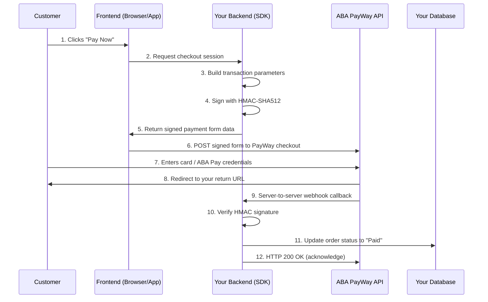

# Chapter 1 — Overview & Core Concepts

> **Estimated reading time:** 15 minutes

Not sure which integration route fits your app? Start with the [platform decision tree](./diagrams/platform-decision-tree.md) — it routes web, native, WebView, Telegram, QR, and deep-linking scenarios to the right chapter.

---

This is a community-maintained server-side SDK, not an official ABA Bank SDK. It requires Node.js 22.12 or later. See [support and compatibility](../SUPPORT.md) for verification limits.

## What Is ABA PayWay?

ABA PayWay is a payment gateway service provided by **ABA Bank Cambodia**. It allows merchants (businesses) to accept payments from customers via:

- **Credit & Debit Cards** (Visa, Mastercard, UnionPay, etc.)
- **ABA Pay** (ABA Bank's mobile banking app)
- **KHQR / Bakong** (Cambodia's national QR code payment standard)
- **Alipay** & **WeChat Pay** (international wallets)

The **ABA PayWay TypeScript SDK** (`aba-payway-ts`) is a server-side Node.js library that makes it easy for developers to call PayWay's API endpoints without manually implementing HMAC signatures, RSA encryption, or field ordering rules.

> ⚠️ **Security Warning:** This SDK runs on your **server only** (Node.js). Never use it in a browser or mobile app — it contains your secret API key and credentials.

---

## The Payment Lifecycle

Here's how a typical payment flows from your customer to ABA and back:



### Step-by-Step Explanation

1. **Customer clicks "Pay Now"** — The user initiates a payment on your website or app.

2. **Frontend requests checkout from backend** — Your frontend sends an API call to your own backend server (e.g., `POST /api/create-checkout`).

3. **Backend builds transaction parameters** — Your server creates a transaction object with the order details (amount, items, currency, etc.).

4. **Backend signs with HMAC-SHA512** — The SDK generates a cryptographic signature so PayWay can verify the request came from you.

5. **Backend returns signed form data** — The SDK returns HTML form fields (or a JSON payload for API-based flows) that your frontend will submit to PayWay.

6. **Frontend POSTs to PayWay** — The user's browser (or app WebView) is redirected to ABA's secure checkout page.

7. **Customer completes payment** — The customer enters their card details or authenticates with ABA Pay on PayWay's hosted page.

8. **Redirect to your return URL** — After payment, PayWay redirects the customer back to your website. **Do not trust the return URL alone to confirm payment** — it can be spoofed or the user may close the browser before it fires.

9. **Server-to-server webhook callback** — PayWay sends a POST request to your server's callback URL with the payment result. This is the **trusted source of truth**.

10. **Backend verifies signature** — Your server uses the SDK to cryptographically verify the webhook came from PayWay (not an attacker).

11. **Database update** — Once verified, you update the order in your database to "Paid" and fulfill the order.

12. **HTTP 200** — Your server responds to PayWay with `200 OK` to acknowledge receipt.

---

## Core Concepts Explained

### Linking / Unlinking / Renewing

Think of a payment token like a **ticket number at a deli counter**:

| Concept | Analogy | What Happens |
|---|---|---|
| **Link** | You take a ticket | A bank account or card is "saved" for future use. PayWay creates a token (`pwt`) that represents this saved credential. |
| **Unlink** | You throw away the ticket | The saved credential is removed. Future payments cannot use this token. |
| **Renew** | You extend the ticket's validity | A token that's about to expire gets a new expiry time. Useful for subscriptions. |

Tokens allow **Credentials-on-File (CoF)** — charging a customer without them re-entering card details each time. This is essential for:

- Subscription billing (monthly charges)
- One-click checkout (returning customers)
- Pre-authorized holds (hotels, car rentals)

### Callbacks (Webhooks) vs. Return URLs

| | Return URL | Callback (Webhook) |
|---|---|---|
| **Who calls it?** | Customer's browser (redirect) | PayWay server (HTTP POST) |
| **Is it trustworthy?** | ❌ No — the user can manipulate or skip it | ✅ Yes — cryptographically signed by PayWay |
| **When does it fire?** | After the customer completes payment | After PayWay confirms payment (may be slightly after) |
| **Purpose** | Show a "Thank You" page to the customer | Update your database with the real payment status |

> ⚠️ **Golden rule:** Never mark an order as "Paid" based on the return URL alone. Always wait for the webhook callback and verify its signature.

### Sandbox vs. Production

| | Sandbox | Production |
|---|---|---|
| **Base URL** | `https://checkout-sandbox.payway.com.kh` | `https://checkout.payway.com.kh` |
| **Purpose** | Test your integration without real money | Process real payments |
| **Merchant ID** | Assigned by ABA's sandbox portal | Assigned by ABA when you go live |
| **API Key** | Sandbox-specific key | Separate production key |
| **Test Cards** | Uses PayWay's test card numbers | Real customer cards only |
| **Behavior Quirks** | Some endpoints behave slightly differently (see sandbox findings) | Full production behavior |

When you use the CLI, save each distinct credential set as a named profile rather than overwriting one `.env` file. A profile is explicitly tagged `sandbox` or `production`; see [Chapter 2 — Credential Profiles](./02-prerequisites-and-setup.md#credential-profiles-for-the-cli) for setup, selection, and storage guidance.

### Test Card Numbers

For sandbox testing, PayWay provides test card numbers that simulate different payment outcomes:

| Card Number | Outcome | 3DS | Use Case |
|---|---|---|---|
| `5156 8399 3770 6777` (MasterCard, exp 01/30, CVV 993) | Approved | No | Test successful payment flow |
| `4286 0900 0000 0206` (Visa, exp 04/30, CVV 777) | Approved | Yes | Success path incl. the 3DS challenge (test OTP arrives by email) |
| `5156 8302 7256 1029` (MasterCard, exp 04/30, CVV 777) | Declined | Yes | Test failure handling |
| `4156 8399 3770 6777` (Visa, exp 01/30, CVV 993) | Declined | No | Decline/error handling without 3DS |

> 📋 **Source:** ABA integration team (2026-09-12) — sandbox-only, never use real card data in sandbox, and these cards are **never valid in production**. ABA may rotate the list: if a card starts failing, request updated sandbox/UAT test cards from the Integration Team. The SDK ships the same list: `payway-sdk sandbox-test-cards` (or `listSandboxTestCards()`), and the ABA Mobile Simulator for ABA PAY / KHQR testing is covered in [Chapter 2](./02-prerequisites-and-setup.md#aba-mobile-simulator-sandbox-testing).

> ⚠️ **Important:** Test cards only work in the sandbox environment. Using them in production will result in declined transactions.

### The 7 API Domains

The SDK organizes PayWay's features into 7 logical groups:

| # | Domain | SDK Access | Purpose |
|---|---|---|---|
| 1 | **Checkout** | `payway.checkout` | Standard e-commerce transactions, refunds, exchange rates |
| 2 | **Credentials-on-File** | `payway.credentialsOnFile` | Save cards/accounts for recurring payments |
| 3 | **QR API** | `payway.qr` | Generate KHQR QR codes dynamically via API |
| 4 | **Payment Link** | `payway.paymentLink` | Create shareable payment links (no website needed) |
| 5 | **Pre-Authorization** | `payway.preAuth` | Hold funds on a card, capture/cancel later |
| 6 | **Payout** | `payway.payout` | Send money to bank accounts (beneficiaries) |
| 7 | **KHQR** | `payway.khqr` | KHQR transaction lookup + offline QR generation |

---

## How the SDK Authenticates with PayWay

Every API call to PayWay must be **cryptographically signed**. The SDK handles this automatically:

### HMAC-SHA512 Signing

The SDK concatenates specific parameter values in a **fixed order** and computes an HMAC-SHA512 hash using your API key as the secret. The exact order of fields **varies by endpoint** (a PayWay quirk verified in sandbox testing).

For example, the checkout `createTransaction` uses this field order:

```
req_time + merchant_id + tran_id + amount + firstname + lastname + ... + hash
```

> 🐛 **Known quirk:** PayWay's own PHP sample code uses arithmetic `+` which produces "Wrong Hash" errors. The correct operator is string concatenation (`.` in PHP, `+` in TypeScript).

### RSA Encryption (Some Endpoints)

Endpoints like **Pre-Auth**, **Payout**, and **Payment Link** require RSA-encrypted `merchant_auth` or `beneficiaries` fields. The SDK uses your RSA public key (provided by ABA) to encrypt these payloads in 117-byte chunks with PKCS1 padding.

---

## Quick Reference: When to Use What

| I want to... | Use this SDK domain |
|---|---|
| Accept a one-time card payment | `payway.checkout.createTransaction()` |
| Accept payment via QR code | `payway.qr.generateQr()` |
| Charge a saved card again | `payway.credentialsOnFile.payment()` |
| Refund a payment | `payway.checkout.refund()` |
| Hold money before charging | `payway.preAuth.complete()` |
| Send money to someone | `payway.payout.payout()` |
| Send a payment link via WhatsApp/email | `payway.paymentLink.create()` |
| Verify a webhook from PayWay | `payway.verifyCallback()` |
| Test my credentials work | `payway.checkout.getExchangeRate()` |

---

## Next Steps

Now that you understand the concepts, proceed to **[Chapter 2 — Prerequisites & Setup](./02-prerequisites-and-setup.md)** to get your credentials and environment configured.

> 🤖 **Agentic CLI:** You can also let a supported provider drive these payments through the risk-gated agentic CLI. See the [Agentic PayWay CLI guide](./QUICK-START-1-PAGER.md#agentic-payway-cli) and the [aba-payway-agent](../skills/aba-payway-agent/SKILL.md) / [aba-payway-first-payment](../skills/aba-payway-first-payment/SKILL.md) skill guides.

> ← [Back to Documentation Home](./README.md) | [Next: Prerequisites & Setup →](./02-prerequisites-and-setup.md)
