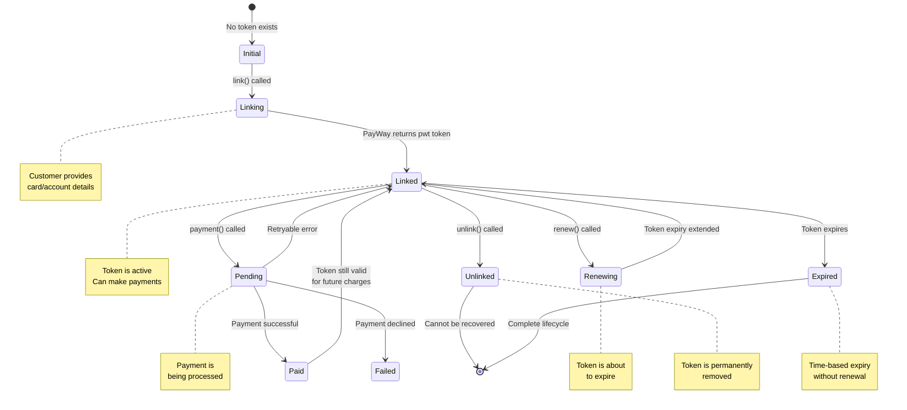

# Chapter 9 — Link / Unlink / Renew Lifecycle

> **Estimated reading time:** 15 minutes  
> **Goal:** Understand how to save, manage, and charge customer payment methods using Credentials-on-File (CoF).

---

## What Is Credentials-on-File (CoF)?

Credentials-on-File allows you to **save a customer's payment method** (bank account or credit/debit card) as a token, then charge it later — without the customer re-entering their details. This is essential for:

| Use Case | Example |
|---|---|
| **Subscription billing** | Monthly Netflix-style charges |
| **One-click checkout** | Returning customers pay with a saved card |
| **Pre-authorized holds** | Hotels hold a deposit, then charge at checkout |
| **Marketplace payouts** | Save seller bank accounts for future payouts |

---

## The Token Lifecycle

A saved payment token goes through these states:



---

## The State × Action Table

Here's every possible combination of token state and what you can do:

| Current State | Action | Method | Result |
|---|---|---|---|
| **None** | Link Account | `credentialsOnFile.linkAccount()` | Token created (bank account) |
| **None** | Link Card | `credentialsOnFile.linkCard()` | Token created (credit/debit card) |
| **Linked** | Make Payment | `credentialsOnFile.payment()` | Charge the saved method |
| **Linked** | Renew Token | `credentialsOnFile.renewToken()` | Extend token expiry |
| **Linked** | Get Details | `credentialsOnFile.getTokenDetails()` | View token info |
| **Linked** | Unlink | `credentialsOnFile.removeToken()` | Permanently remove |
| **Pending** | Wait | — | Token is in-use; retry after resolution |
| **Expired** | Renew | `credentialsOnFile.renewToken()` | Reactivate expired token |
| **Expired** | Link Again | `linkAccount()` / `linkCard()` | Create a fresh token |
| **Unlinked** | — | — | Cannot be recovered; create new token |

---

## Step-by-Step Code Examples

### 1. Link a Bank Account

Save a customer's bank account for future charges:

```typescript
// Backend: Link a customer's bank account
import { payway } from '../config/payway';

async function linkCustomerAccount() {
  try {
    const result = await payway.credentialsOnFile.linkAccount({
      // Your unique request ID for idempotency (required)
      requestId: `link-${Date.now()}`,

      // Your customer reference — used across all CoF operations (required)
      // This is how you identify the customer in your system
      ctid: 'customer-abc-123',

      // Token usage flag (required)
      // 'CITR_FLEX' = Customer-Initiated Transaction, Recurring + Flexible
      tokenFlag: 'CITR_FLEX',

      // Currency for future charges
      currency: 'USD',

      // Optional: Deep link for mobile apps
      returnDeeplink: {
        ios_scheme: 'myapp://payment-result',
        android_scheme: 'myapp://payment-result',
      },

      // Optional: Callback URL for completion notification
      callbackUrl: `${process.env.BASE_URL}/api/cof-callback`,
    });

    console.log('Account linked successfully:', result);

    // The response contains a pwt (PayWay Token) and/or redirect info
    // Store the pwt in your database alongside the ctid
    // await db.query(
    //   'INSERT INTO saved_payments (ctid, pwt, type) VALUES ($1, $2, $3)',
    //   ['customer-abc-123', result.pwt, 'account']
    // );

    return result;
  } catch (error) {
    console.error('Failed to link account:', error);
    throw error;
  }
}
```

### 2. Link a Credit/Debit Card

Save a customer's card — note the important differences from linking an account:

```typescript
async function linkCustomerCard() {
  try {
    const result = await payway.credentialsOnFile.linkCard({
      // Your unique request ID (required)
      requestId: `link-${Date.now()}`,

      // Customer identifier (required)
      ctid: 'customer-abc-123',

      // Token usage flag (required)
      tokenFlag: 'CITR_FLEX',

      // ⚠️ frequency is REQUIRED for card linking (verified in sandbox)
      // '1W' = weekly, '1M' = monthly, '2M' = every 2 months
      frequency: '1M',

      // Return URL where the customer is redirected after adding their card
      returnUrl: `${process.env.BASE_URL}/saved-cards`,

      // Optional: Callback URL
      callbackUrl: `${process.env.BASE_URL}/api/cof-callback`,
    });

    console.log('Card linked successfully:', result);

    // Store the token reference
    // await db.query(
    //   'INSERT INTO saved_payments (ctid, pwt, type, frequency) VALUES ($1, $2, $3, $4)',
    //   ['customer-abc-123', result.pwt, 'card', '1M']
    // );

    return result;
  } catch (error) {
    console.error('Failed to link card:', error);
    throw error;
  }
}
```

> ⚠️ **Critical difference:** `linkCard()` requires `frequency` and uses `application/x-www-form-urlencoded` (the SDK handles the encoding automatically). `linkAccount()` uses JSON. This was verified in sandbox testing — sending JSON to `link-card` will be rejected without being read.

### Sandbox-verified facts (2026-08-25 scope campaign)

- **`linkCard()` also requires `currency`** — the SDK now defaults it to `'USD'`; pass the customer's currency explicitly. Server rejects without it: `"The currency field is required."`
- **A successful `linkCard()` returns an HTTP 200 HTML page** (the hosted card-entry checkout), not JSON — redirect the customer to it / embed it. Treat "HTML body" as the success signal for this one endpoint.
- **Valid `token_flag` values differ per endpoint:**
  - Linking (`link-account`, `link-card`): `CITI_FLEX | CITO_FLEX | CITO_FIX | CITR_FLEX`
  - Charging (`payment-credential`): `CITU_FLEX | MITU_FLEX | MITU_FIX | MITR_FLEX | MITR_FIX`
  - (C = customer-initiated, M = merchant-initiated; IT/TR ≈ initial transaction / recurring; FLEX/FIX = flexible or fixed amount.)
- **Token management trio needs a `request` field**: renew/get-details/remove models require flat `request_time`, `request_id`, `request`, `ctid`, `pwt`. The SDK now sends `request` automatically (defaults to your `requestId`). Their HMAC composition remains unpublished — see [SANDBOX-FINDINGS §9a](./SANDBOX-FINDINGS.md).
- PayWay's binding layer answers malformed CoF payloads with **HTTP 400 code `"04"` plus a per-field `errors{}` map** — read `error.rawBody.status.errors` for exact field messages when debugging.
- The KHQR `get-transactions-by-mc-ref` endpoint returns 404 in this sandbox profile.

### 3. Charge a Saved Payment Method

Once you have a token (`pwt`), charge it:

```typescript
async function chargeSavedCard() {
  try {
    const result = await payway.credentialsOnFile.payment({
      // Your unique request ID (required)
      requestId: `charge-${Date.now()}`,

      // Unique transaction ID for this charge (required)
      transactionId: `order-${Date.now()}`,

      // Amount to charge (required)
      amount: 25.00,

      // Customer identifier — must match the linked token (required)
      ctid: 'customer-abc-123',

      // ⚠️ The field name is 'pwt', NOT 'paymentToken' (verified in sandbox)
      paymentToken: '[REMOVED-HISTORICAL-81b242e05d38]', // This gets mapped to 'pwt' by the SDK

      // Token usage flag
      tokenFlag: 'CITR_FLEX',

      // Currency
      currency: 'USD',

      // Callback URL for payment confirmation
      callbackUrl: `${process.env.BASE_URL}/api/payway-webhook`,
    });

    console.log('Charge result:', result);
    return result;
  } catch (error) {
    console.error('Charge failed:', error);
    throw error;
  }
}
```

> 🐛 **Field name quirk:** In sandbox testing, PayWay strictly requires the token field to be named `pwt` in the API request (not `payment_token`). The SDK automatically maps `paymentToken` to `pwt` in the payload.

### 4. Check Token Status / Get Details

```typescript
async function checkTokenStatus() {
  try {
    const details = await payway.credentialsOnFile.getTokenDetails({
      // Your request ID (required)
      requestId: `check-${Date.now()}`,

      // Customer identifier (required for token management)
      ctid: 'customer-abc-123',

      // The token to check (required)
      paymentToken: '[REMOVED-HISTORICAL-81b242e05d38]',
    });

    console.log('Token details:', details);
    // Check if the token is still valid, when it expires, etc.
    return details;
  } catch (error) {
    console.error('Token check failed:', error);
    throw error;
  }
}
```

### 5. Renew an Expiring Token

Tokens have a limited lifetime. Renew them before expiry:

```typescript
async function renewToken() {
  try {
    const result = await payway.credentialsOnFile.renewToken({
      // Your request ID (required)
      requestId: `renew-${Date.now()}`,

      // Customer identifier (required)
      ctid: 'customer-abc-123',

      // The token to renew (required)
      paymentToken: '[REMOVED-HISTORICAL-81b242e05d38]',

      // Token usage flag
      tokenFlag: 'CITR_FLEX',
    });

    console.log('Token renewed:', result);
    // The token's expiry is extended
    return result;
  } catch (error) {
    console.error('Token renewal failed:', error);
    // Token may have expired — catch this and prompt customer to re-link
    throw error;
  }
}
```

### 6. Unlink (Remove) a Saved Payment Method

Permanently remove a saved token:

```typescript
async function unlinkToken() {
  try {
    const result = await payway.credentialsOnFile.removeToken({
      // Your request ID (required)
      requestId: `unlink-${Date.now()}`,

      // Customer identifier (required)
      ctid: 'customer-abc-123',

      // The token to remove (required)
      paymentToken: '[REMOVED-HISTORICAL-81b242e05d38]',
    });

    console.log('Token removed:', result);

    // Delete from your database
    // await db.query(
    //   'DELETE FROM saved_payments WHERE ctid = $1 AND pwt = $2',
    //   ['customer-abc-123', '[REMOVED-HISTORICAL-81b242e05d38]']
    // );

    return result;
  } catch (error) {
    console.error('Unlink failed:', error);
    throw error;
  }
}
```

---

## Best Practices

### 1. Always Unlink When the User Removes a Payment Method

If your UI has a "Remove Saved Card" button, always call `removeToken()` when the user clicks it:

```typescript
// Frontend: Remove saved card handler
async function onRemoveCardClick(paymentToken: string) {
  const confirmed = confirm('Remove this saved payment method?');
  if (!confirmed) return;

  try {
    await fetch('/api/cof/unlink', {
      method: 'POST',
      headers: { 'Content-Type': 'application/json' },
      body: JSON.stringify({
        ctid: currentUser.id,
        paymentToken,
      }),
    });
    // Remove from UI
    refreshSavedCards();
  } catch (error) {
    alert('Failed to remove card. Please try again.');
  }
}
```

### 2. Handle Token Expiry Gracefully

Tokens expire. Your application should handle this:

```typescript
async function chargeWithExpiryHandling(ctid: string, pwt: string, amount: number) {
  try {
    return await payway.credentialsOnFile.payment({
      requestId: `charge-${Date.now()}`,
      transactionId: `order-${Date.now()}`,
      amount,
      ctid,
      paymentToken: pwt,
      tokenFlag: 'CITR_FLEX',
      currency: 'USD',
    });
  } catch (error) {
    if (error instanceof PayWayAPIError && error.paywayCode === '22') {
      // Token expired — try to renew
      console.log('Token expired, attempting renewal...');
      try {
        await payway.credentialsOnFile.renewToken({
          requestId: `renew-${Date.now()}`,
          ctid,
          paymentToken: pwt,
          tokenFlag: 'CITR_FLEX',
        });
        // Retry the charge after successful renewal
        return await chargeWithExpiryHandling(ctid, pwt, amount);
      } catch (renewError) {
        // Renewal failed — token is permanently dead
        throw new Error('Payment method has expired. Please add a new payment method.');
      }
    }
    throw error; // Re-throw any other errors
  }
}
```

### 3. Use ctid as Your Internal Customer Reference

The `ctid` field is your link between PayWay tokens and your customer records. Use your own customer IDs consistently:

```typescript
// ✅ Good: Consistent ctid across all CoF operations
const ctid = `user_${currentUser.id}`; // e.g., "user_42"

// ❌ Bad: Random ctid per operation — you can't track what belongs to whom
const ctid = `temp-${Date.now()}`;
```

### 4. Database Schema for Saved Tokens

```sql
-- PostgreSQL schema for storing saved payment tokens
CREATE TABLE saved_payments (
  id            SERIAL PRIMARY KEY,
  ctid          VARCHAR(255) NOT NULL,       -- Your customer reference
  pwt           VARCHAR(500) NOT NULL,       -- PayWay token
  type          VARCHAR(20) NOT NULL,        -- 'account' or 'card'
  frequency     VARCHAR(10),                  -- '1W', '1M', '2M' (cards only)
  last_four     VARCHAR(4),                   -- Last 4 digits (from getTokenDetails)
  is_active     BOOLEAN DEFAULT true,
  created_at    TIMESTAMP DEFAULT NOW(),
  expires_at    TIMESTAMP,
  linked_at     TIMESTAMP DEFAULT NOW(),

  -- One customer can have multiple saved methods,
  -- but the same token shouldn't appear twice
  UNIQUE (ctid, pwt)
);

CREATE INDEX idx_saved_payments_ctid ON saved_payments(ctid);
```

### 5. Webhook Handling for CoF Events

CoF operations (like `payment()`) also trigger webhooks. Handle them the same way as checkout webhooks:

```typescript
// Your webhook handler should handle both checkout and CoF events
router.post('/api/payway-webhook', (req, res) => {
  const { hash, ...body } = req.body;
  const isValid = payway.verifyCallback(body, hash);

  if (!isValid) {
    return res.status(400).json({ error: 'Invalid signature' });
  }

  const { tran_id, ctid } = req.body;

  // Update order status for CoF payments
  // await db.query(
  //   'INSERT INTO orders (tran_id, ctid, status) VALUES ($1, $2, $3)
  //    ON CONFLICT (tran_id) DO UPDATE SET status = EXCLUDED.status',
  //   [tran_id, ctid, 'paid']
  // );

  res.status(200).json({ received: true });
});
```

---

## Common Pitfall: Forgetting to Unlink

**Scenario:** A customer adds a debit card, makes a purchase, then removes the card from your app's UI — but you forget to call `removeToken()`.

**Result:** The token still exists in PayWay's system. If another transaction uses that `pwt`, it will still attempt to charge the card. The customer thinks their card is removed, but it's actually still chargeable.

**Solution:** Always build the unlink call into your "remove card" flow:

```typescript
// ❌ Bad: Only removes from your database
async function removeCardLocally(ctid: string, pwt: string) {
  await db.query('DELETE FROM saved_payments WHERE ctid = $1 AND pwt = $2', [ctid, pwt]);
}

// ✅ Good: Removes from PayWay AND your database
async function removeCardProperly(ctid: string, pwt: string) {
  // Step 1: Remove from PayWay (this is the important one)
  await payway.credentialsOnFile.removeToken({
    requestId: `unlink-${Date.now()}`,
    ctid,
    paymentToken: pwt,
  });

  // Step 2: Clean up your database
  await db.query('DELETE FROM saved_payments WHERE ctid = $1 AND pwt = $2', [ctid, pwt]);
}
```

---

## Next Steps

- **For webhook handling** → [Chapter 11 — Callbacks & Webhooks](./11-callbacks-and-webhooks.md)
- **For pre-authorization flow** → The Pre-Auth domain in the SDK README
- **For testing CoF with sandbox** → [Chapter 2 — Prerequisites & Setup](./02-prerequisites-and-setup.md)

> ← [Previous: QR Code Handling](./07-qr-code-handling.md) | [Next: Callbacks & Webhooks →](./11-callbacks-and-webhooks.md)