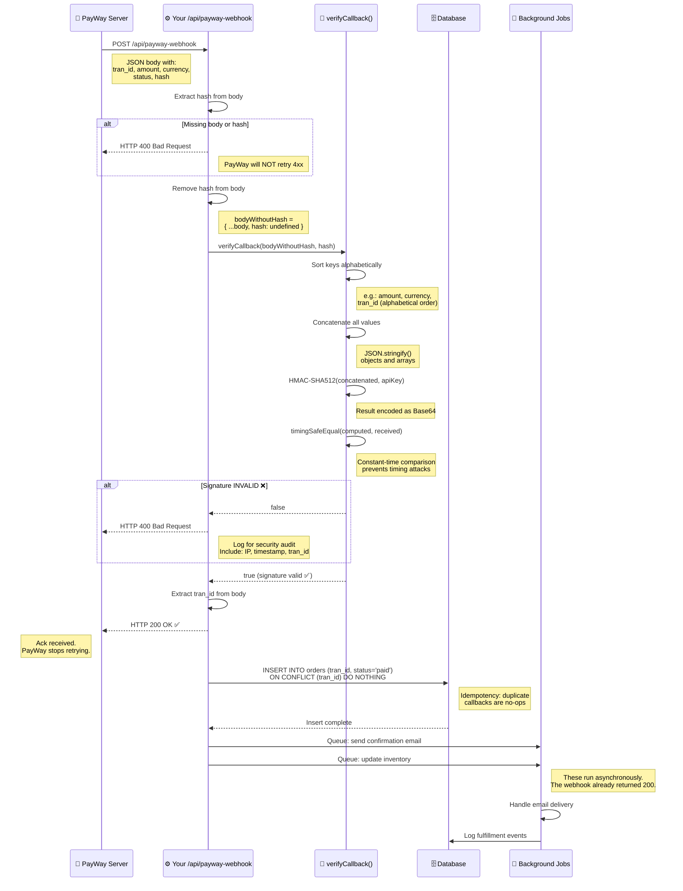

# Callback Flow Diagram

This sequence diagram shows the secure webhook verification process — from PayWay's server to your order fulfillment.



---

## Step-by-Step: What Happens in the Webhook

### 1. Arrival
PayWay POSTs JSON to your webhook URL with a `hash` field.

### 2. Verification (Critical)
The SDK's `verifyCallback()` performs:
- **Sort keys alphabetically** — `amount` before `currency` before `tran_id`
- **Concatenate values** — objects are `JSON.stringify()`'d
- **Compute HMAC-SHA512** — with your API key, output as Base64
- **Timing-safe comparison** — prevents attackers from guessing the signature one character at a time

### 3. Response (Must Be Fast)
Respond with **HTTP 200** as soon as signature is verified. PayWay expects a response within ~5 seconds.

### 4. Processing (After Response)
After responding, update your database and trigger fulfillment. Use `ON CONFLICT DO NOTHING` to handle duplicate callbacks.

---

## Related Code

**SDK source:**
```typescript
// src/auth.ts — verifyCallbackSignature()
export function verifyCallbackSignature(
  body: Record<string, any>,
  receivedSignature: string,
  apiKey: string
): boolean {
  const sortedKeys = Object.keys(body).sort();
  const concatenated = sortedKeys
    .map((key) => {
      const val = body[key];
      if (val === undefined || val === null) return '';
      if (typeof val === 'object') return JSON.stringify(val);
      return String(val);
    })
    .join('');

  const computed = crypto.createHmac('sha512', apiKey)
    .update(concatenated)
    .digest('base64');

  return crypto.timingSafeEqual(
    Buffer.from(computed),
    Buffer.from(receivedSignature)
  );
}
```

---

## Related Sections

- [Chapter 11 — Callbacks & Webhooks](../guides/11-callbacks-and-webhooks.md) — Full implementation guide
- [Chapter 12 — Error Handling & Debugging](../guides/12-error-handling-and-debugging.md) — Common callback errors
- [Chapter 13 — Deployment Checklist](../guides/13-deployment-checklist.md) — Go-live verification

> ← [Back to Documentation Home](../README.md)