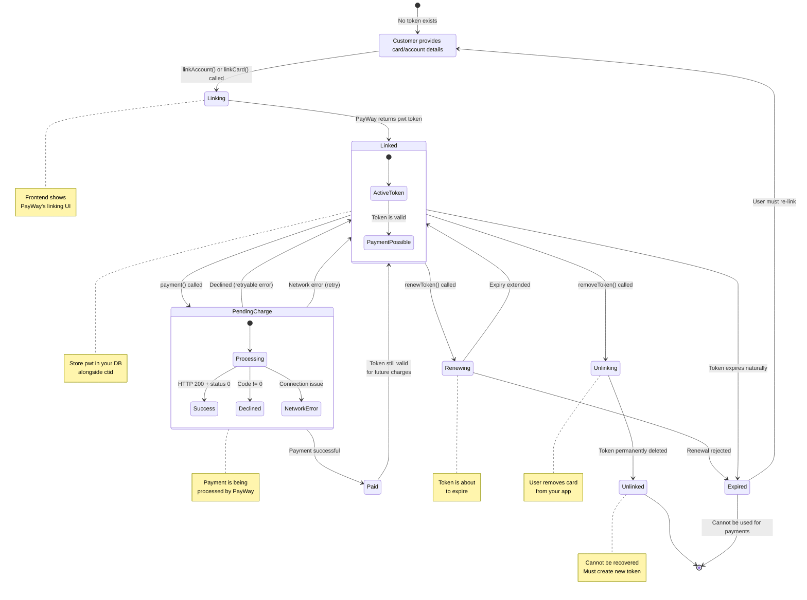

# Link / Unlink State Machine Diagram

This state diagram shows the complete lifecycle of a saved payment token (pwt) in PayWay's Credentials-on-File (CoF) system.

---

## State Transitions by SDK Method

| From | To | Trigger | SDK Method | Notes |
|---|---|---|---|---|
| Initial | Linking | User clicks "Add Payment Method" | `linkAccount()` or `linkCard()` | PayWay shows its own UI for card/account entry |
| Linking | Linked | PayWay returns `pwt` | (Response from link call) | Store `pwt` and `ctid` in your database |
| Linked | PendingCharge | Merchant initiates payment | `payment()` | Creates a new `tran_id` |
| PendingCharge | Paid | Payment authorization succeeds | (Webhook callback) | Update order status via callback |
| PendingCharge | Linked | Payment declined / retryable | (Error response) | Retry with backoff |
| Linked | Renewing | Token nearing expiry | `renewToken()` | Extends token validity period |
| Renewing | Linked | Renewal accepted | (Response from renew call) | Token usable again |
| Linked | Unlinking | User removes payment method | `removeToken()` | **Always call this before deleting from DB** |
| Unlinking | Unlinked | Token deleted | (Response from remove call) | Permanently gone |
| Linked | Expired | Token lifetime exceeded | (Time-based) | Must re-link |

---

## Developer Checklist for Each Transition

### When Linking (Initial → Linking → Linked)

- [ ] Generate a unique `requestId` for idempotency
- [ ] Use a consistent `ctid` (your customer ID)
- [ ] For cards: include `frequency` and `returnUrl`
- [ ] Store the returned `pwt` in your database alongside `ctid`
- [ ] Handle the redirect back from PayWay's linking page

### When Charging (Linked → PendingCharge → Paid/Failed)

- [ ] Use a unique `transactionId` per charge attempt
- [ ] Verify the `ctid` matches the stored token
- [ ] Handle `code: "22"` (expired token) by attempting renewal
- [ ] Wait for webhook callback before marking order as paid
- [ ] Use `ON CONFLICT (tran_id) DO NOTHING` for idempotent callbacks

### When Renewing (Linked → Renewing → Linked)

- [ ] Check token expiry before attempting charge
- [ ] Renew tokens proactively (e.g., 7 days before expiry)
- [ ] Handle renewal failure gracefully — prompt user to re-link

### When Unlinking (Linked → Unlinking → Unlinked)

- [ ] **Always call `removeToken()` before deleting from your database**
- [ ] Confirm with user before unlinking
- [ ] Show success/failure feedback in the UI

---

## Related Sections

- [Chapter 9 — Link / Unlink / Renew Lifecycle](../guides/09-link-unlink-renew-lifecycle.md) — Full implementation guide
- [Chapter 1 — Overview & Concepts](../guides/01-overview-and-concepts.md) — Token concepts explained
- [Glossary](../reference/glossary.md) — Definitions of pwt, ctid, CoF, token flag

> ← [Back to Documentation Home](../README.md)