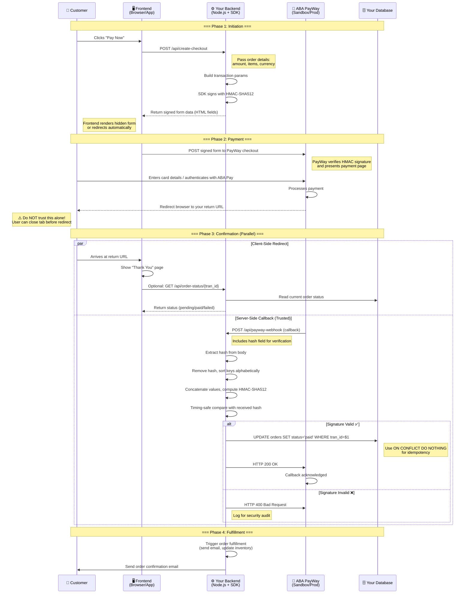

# Payment Lifecycle Diagram

This sequence diagram shows the complete payment flow from customer to PayWay and back, including the critical distinction between the **return URL** (untrusted, client-side) and the **webhook callback** (trusted, server-side).

---

## Key Takeaways from This Diagram

### 1. Two Confirmation Channels
PayWay uses **two separate mechanisms** to notify you about a payment:

- **Client-side redirect (return URL):** The customer's browser is redirected to your website after payment. This is **untrustworthy** — the user can close the tab, manipulate the URL, or the redirect may never fire.
- **Server-side callback (webhook):** PayWay's servers POST directly to your backend. This is **cryptographically signed** and is the only reliable source of truth.

### 2. Idempotency Matters
PayWay may send callbacks more than once for the same transaction. You must handle duplicate webhooks gracefully using the `tran_id` as an idempotency key. In the diagram, this is shown as `ON CONFLICT DO NOTHING`.

### 3. Fast 200 Response
Your webhook handler must respond with HTTP 200 as quickly as possible. Any heavy processing (sending emails, updating inventory) should happen **after** responding to PayWay, or in a background job queue.

### 4. The HMAC Verification Steps

For the webhook callback, the verification algorithm is:

1. Extract the `hash` field from the request body
2. Remove `hash` from the body (don't include it in verification)
3. Sort the remaining keys **alphabetically**
4. Concatenate all values (JSON-encoding objects/arrays)
5. Compute HMAC-SHA512 with your API key
6. Compare using timing-safe comparison

This is handled automatically by `payway.verifyCallback()` in the SDK.

---

## Related Sections

- [Chapter 1 — Overview & Concepts](../01-overview-and-concepts.md) — High-level concepts
- [Chapter 11 — Callbacks & Webhooks](../11-callbacks-and-webhooks.md) — Detailed webhook implementation
- [Chapter 3 — Web Implementation](../03-web-implementation.md) — Building your first checkout flow

> ← [Back to Documentation Home](../README.md)