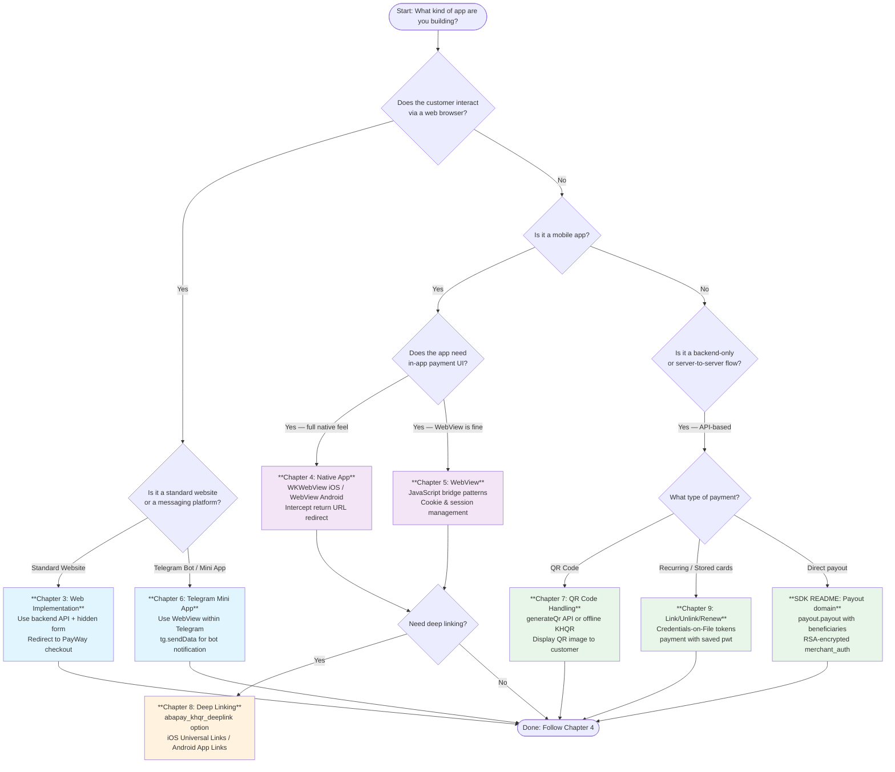

# Platform Decision Tree

Use this flowchart to determine which integration approach is right for your application.

---

## Quick Reference: Which Chapter for Which Platform

| Your Platform | Read These Chapters |
|---|---|
| **Web (Next.js, Express, PHP, etc.)** | 1 → 2 → 3 → 11 → 13 |
| **iOS App (Swift)** | 1 → 2 → 4 → 5 → 8 → 11 |
| **Android App (Kotlin)** | 1 → 2 → 4 → 5 → 8 → 11 |
| **React Native / Flutter** | 1 → 2 → 5 (WebView patterns apply) → 11 |
| **Telegram Mini App** | 1 → 2 → 6 → 11 |
| **QR-only (no frontend)** | 1 → 2 → 7 → 11 → 13 |
| **Recurring / Subscription** | 1 → 2 → 9 → 11 → 13 |
| **Payout / Marketplace** | 1 → 2 → (SDK README Payout section) → 11 |

> ← [Back to Documentation Home](../README.md)