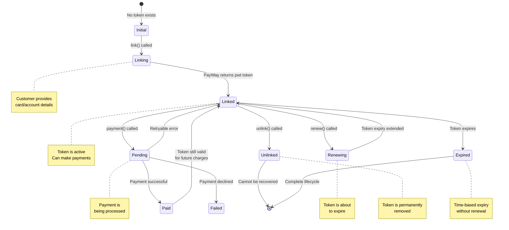

<!-- GENERATED STUB: copy of docs/guides/09-link-unlink-renew-lifecycle.md for compatibility. Do not edit here. -->

# Chapter 9 — Link / Unlink / Renew Lifecycle

> **Estimated reading time:** 15 minutes  
> **Goal:** Understand how to save, manage, and charge customer payment methods using Credentials-on-File (CoF).

Token state machine at a glance: [Link / Unlink State Machine](../diagrams/link-unlink-state-machine.md) — every transition keyed to the SDK method that performs it.

---

## What Is Credentials-on-File (CoF)?

Credentials-on-File allows you to **save a customer's payment method** (bank account or credit/debit card) as a token, then charge it later — without the customer re-entering their details. This is essential for:

| Use Case | Example |
|---|---|
| **Subscription billing** | Monthly Netflix-style charges |
| **One-click checkout** | Returning customers pay with a saved card |
| **Pre-authorized holds** | Hotels hold a deposit, then charge at checkout |
| **Marketplace payouts** | Save seller bank accounts for future payouts |

---

## The Token Lifecycle

A saved payment token goes through these states:



---

## The State × Action Table

Here's every possible combination of token state and what you can do:

| Current State | Action | Method | Result |
|---|---|---|---|
| **None** | Link Account | `credentialsOnFile.linkAccount()` | Token created (bank account) |
| **None** | Link Card | `credentialsOnFile.linkCard()` | Token created (credit/debit card) |
| **Linked** | Make Payment | `credentialsOnFile.payment()` | Charge the saved method |
| **Linked** | Renew Token | `credentialsOnFile.renewToken()` | Extend token expiry |
| **Linked** | Get Details | `credentialsOnFile.getTokenDetails()` | View token info |
| **Linked** | Unlink | `credentialsOnFile.removeToken()` | Permanently remove |
| **Pending** | Wait | — | Token is in-use; retry after resolution |
| **Expired** | Renew | `credentialsOnFile.renewToken()` | Reactivate expired token |
| **Expired** | Link Again | `linkAccount()` / `linkCard()` | Create a fresh token |
| **Unlinked** | — | — | Cannot be recovered; create new token |

---

## Step-by-Step Code Examples

### 1. Link a Bank Account

Save a customer's bank account for future charges:

```typescript
// Backend: Link a customer's bank account
import { payway } from '../config/payway';

async function linkCustomerAccount() {
  try {
    const result = await payway.credentialsOnFile.linkAccount({
      // Your unique request ID for idempotency (required)
      requestId: `link${Date.now()}`,

      // Your customer reference — used across all CoF operations (required)
      // This is how you identify the customer in your system
      ctid: 'customerabc123',

      // Token usage flag (required) — live-documented linking values
      // 'CITI_FLEX' = Customer-Initiated Transaction, Initial + Flexible
      tokenFlag: 'CITI_FLEX',

      // Currency for future charges
      currency: 'USD',

      // Optional: Deep link for mobile apps
      returnDeeplink: {
        ios_scheme: 'myapp://payment-result',
        android_scheme: 'myapp://payment-result',
      },

      // Optional: Callback URL for completion notification
      callbackUrl: `${process.env.BASE_URL}/api/cof-callback`,
    });

    console.log('Account link requested:', result);

    // ⚠️ The response does NOT contain the pwt: the response carries the
    // approval QR/deeplink (`data.qr_string`, `data.deeplink` — form
    // `abamobilebank://ababank.com?type=account_on_file&qrcode=…` — and
    // `data.expire_in`, an epoch-seconds EXPIRY INSTANT — the live scan
    // window is only ~90 s (§26 AOF-12; the "10 minutes" in the docs is
    // wrong for link-account QRs). The
    // token itself is delivered later to your callbackUrl webhook. LIVE shape
    // (captured 2026-09-15, SANDBOX-FINDINGS §26 AOF-7): only `request_id` at
    // the top level, everything else nested in `payment_credential`
    // (`{ctid, pwt, source_of_fund, type, status: 1, expired_at, token_flag,
    // frequency, subscribed_amount, amount_limit_per_tran, currency}`) — that
    // `status` is the CREDENTIAL status (1 = active), NOT a transaction
    // status. ⚠️ The callback's `X-PAYWAY-HMAC-SHA512` header does NOT verify
    // under the documented sorted-key canonicalization (§26 AOF-8; the
    // callback canonicalization is unpublished — ABA question Q18.5): confirm
    // via `getTokenDetails({ requestId })` (transitive auth) before trusting
    // the delivery, then store the pwt against the ctid:
    // const details = await payway.credentialsOnFile.getTokenDetails({ requestId: body.request_id });
    // await db.query(
    //   'INSERT INTO saved_payments (ctid, pwt, type) VALUES ($1, $2, $3)',
    //   ['customerabc123', details.pwt, 'account']
    // );

    return result;
  } catch (error) {
    console.error('Failed to link account:', error);
    throw error;
  }
}
```

### 2. Link a Credit/Debit Card

Save a customer's card — note the important differences from linking an account:

```typescript
async function linkCustomerCard(res: Response) {
  try {
    await payway.credentialsOnFile.linkCard({
      // Your unique request ID (required)
      requestId: `link${Date.now()}`,

      // Customer identifier (required)
      ctid: 'customerabc123',

      // Token usage flag (required) — live-documented linking values
      tokenFlag: 'CITI_FLEX',

      // Live-documented as required for Link Card
      // '1W' = weekly, '1M' = monthly, '2M' = every 2 months
      frequency: '1M',

      // REQUIRED in practice: the pwt token is delivered ONLY to this URL
      callbackUrl: `${process.env.BASE_URL}/api/cof-callback`,

      // Optional: target of the hosted form's "Done" button
      // (the SDK base64-encodes a plain URL automatically)
      continueSuccessUrl: `${process.env.BASE_URL}/saved-cards`,
    });
  } catch (error) {
    // ⚠️ EXPECTED PATH: link-card ALWAYS answers with the hosted card-entry
    // HTML page (success AND error), so linkCard() always THROWS a
    // PayWayBusinessError carrying that page in rawBody — it never resolves.
    if (error instanceof PayWayBusinessError
        && typeof error.rawBody === 'string'
        && /<!doctype html|<html/i.test(error.rawBody)) {
      // Serve/redirect the customer to the hosted card-entry page:
      res.type('html').send(error.rawBody);

      // A hosted rejection (e.g. profile code 104 "Merchant not enabled
      // token flag") is decoded from the /add-card/<base64> redirect target
      // into error.hostedPage (SANDBOX-FINDINGS §24 LC-2) — read it when you
      // need a server-side signal instead of serving the page:
      if (error.hostedPage?.code) {
        console.error('Hosted page error:', error.hostedPage.code, error.hostedPage.message);
      }
      return;
    }
    throw error;
  }
}

// Later, on your callbackUrl webhook: the card token (pwt) arrives in the
// signed callback — verify it (verifyCallback with the hash stripped) and
// store it against the ctid:
// await db.query(
//   'INSERT INTO saved_payments (ctid, pwt, type, frequency) VALUES ($1, $2, $3, $4)',
//   ['customerabc123', pwt, 'card', '1M']
// );
```

> ⚠️ **Critical difference:** `linkCard()` uses `application/x-www-form-urlencoded` (the SDK handles the encoding automatically) and answers with an **HTML page** (the hosted card-entry form). `linkAccount()` uses JSON. This was verified in sandbox testing — sending JSON to `link-card` will be rejected without being read. Note: `returnUrl`/`returnDeeplink` are **no longer sent** on link-card (absent from the live request); the hosted form's done-target is `continueSuccessUrl`.

#### Browser-form alternative: `getLinkCardFormHtml()` (no server roundtrip)

Because the endpoint demands form-urlencoded and always answers with a hosted page, the natural integration for card linking is a **plain browser form POST** — the same pattern as `checkout.getCheckoutFormHtml()`. The SDK builds the full signed HTML document locally (hidden fields + §16 HMAC, byte-identical to `linkCard()`); submitting it navigates the customer straight to the hosted card-entry form:

```typescript
const html = payway.credentialsOnFile.getLinkCardFormHtml({
  requestId: `link${Date.now()}`,
  ctid: 'customerabc123',
  tokenFlag: 'CITI_FLEX',
  frequency: '1M',
  callbackUrl: `${process.env.BASE_URL}/api/cof-callback`,
});
res.type('html').send(html);
```

Options: `{ formId, autoSubmit, submitLabel, omitSubmitButton }` (no `popupMode` — the AbaPayway popup plugin is documented for the purchase endpoint only). There is no `pwt` in the response either way: the token always arrives via `callbackUrl`.

CLI equivalents:

```sh
# Local signed form, no API call (HTML to stdout or --out; auto-opens on TTY)
npx tsx src/cli.ts cof link-card-form --ctid customerabc123 --token-flag CITI_FLEX \
  --frequency 1M --callback-url https://example.com/api/cof-callback -o link-card.html

# API call: saves the returned hosted page to payway-output/ and offers to open it
npx tsx src/cli.ts cof link-card -r link67890 --ctid customerabc123 --token-flag CITI_FLEX \
  --callback-url https://example.com/api/cof-callback
```

`cof link-card` treats the HTML page as the success artifact it is: it saves the page to `payway-output/link-card-<request-id>.html` (openable with `--open-page`, auto on interactive terminals) and exits 0 instead of surfacing the B5 structured error. With `--json` it prints a `{ hostedHtmlPath, requestId, ctid, note }` envelope. Since 2026-09-12 (§24) it also decodes the hosted outcome: when the page carries an `/add-card/<base64>` result (e.g. code 104 "Merchant not enabled token flag", wrong-hash 01), human output reports `Hosted page reports an error: code …` with a hint, and the `--json` envelope gains `hostedPage: { url, code, message }` plus the `correlationId`/`traceId` journal join keys — still exit 0, because the saved page is the evidence.

### Sandbox-verified facts (2026-08-25 scope campaign; hash orders re-verified 2026-08-31 — see §16; hosted-page outcome + hash enforcement re-verified 2026-09-12 — see §24)

- **`linkCard()` also requires `currency`** — the SDK now defaults it to `'USD'`; pass the customer's currency explicitly. Server rejects without it: `"The currency field is required."`
- **A successful `linkCard()` call answers HTTP 200 with an HTML page body** (the hosted card-entry checkout), not JSON — and because of that the SDK **throws** a `PayWayBusinessError` carrying the page in `rawBody` for EVERY link-card answer; the SDK performs no page-content success/failure discrimination. Capture-and-serve is the integration (the CLI `cof link-card` does exactly that and exits 0). Since 2026-09-12 the thrown error also carries `responseUrl` + `hostedPage` — the hosted result decoded from the `302 → /add-card/<base64>` redirect target (SANDBOX-FINDINGS §24 LC-2).
- **Valid `token_flag` values differ per endpoint:**
  - Linking (`link-account`, `link-card`): `CITI_FLEX | CITO_FLEX` (live-documented set; other values warn)
  - Charging (`payment-credential`): `CITU_FLEX | MITU_FLEX | MITU_FIX | MITR_FLEX | MITR_FIX`
  - (C = customer-initiated, M = merchant-initiated; IT/TR ≈ initial transaction / recurring; FLEX/FIX = flexible or fixed amount.)
- **Token management trio — param shapes (live-documented, sandbox-verified 2026-08-31):**
  - `renewToken()` takes `{ requestId, ctid, paymentToken }` — hash order `ctid.request_time.pwt.merchant_id.request_id`.
  - `getTokenDetails()` takes **`{ requestId }` only** — no `ctid`, no `pwt` (hash order `merchant_id.request_time.request_id`).
  - `removeToken()` takes **`{ ctid, paymentToken }`** — no `requestId` (hash order `merchant_id.ctid.request_time.pwt`).
  - The old shared `TokenParams` shape was wrong for two of the three endpoints and is deprecated.
- **✅ Token management trio is UN-GATED (2026-08-31):** the earlier TD-03 capability guard is resolved by probe evidence — every live-documented hash composition is **hash-ACCEPTED** by the gateway (business codes 105/09/00/104 past the hash layer), while the §9a-era SDK orders are now rejected with `01 Wrong Hash` (the gateway tightened CoF hash validation since the August campaign). `renewToken()` / `getTokenDetails()` / `removeToken()` work out of the box; `allowUnverifiedTokenOperations: false` re-blocks as a deprecated escape hatch. Evidence: `docs/SANDBOX-FINDINGS.md` §16, `test-output/token-trio/`, probe script `scripts/sandbox-probe-token-trio.ts`.
- **CoF hash orders realigned (breaking, sandbox-verified 2026-08-31):** `link-account` hashes `merchant_id.request_time.ctid.return_deeplink.callback_url.request_id.token_flag.currency`; `link-card` hashes the live order — `amount` always hashes as `''` (no body field), `frequency` hashes its supplied value or `''` when omitted — with `continue_success_url` last; `cofPayment` hashes the live 19-field order. `linkCard()` no longer sends `returnUrl`/`returnDeeplink` (absent from the live request — use `continueSuccessUrl` for the hosted form's Done button); `cofPayment()` no longer sends `request_id` (deprecated param).
- **Client-side identifier parity (TD-06):** `requestId`/`ctid` must match the gateway rule `[a-zA-Z0-9]{5,24}` — letters/digits only, 5–24 chars, **no hyphens or underscores**. The SDK now fails fast locally instead of surfacing the gateway's per-field errors map. `transactionId` keeps its own rule (`[a-zA-Z0-9-]{1,20}`, hyphens allowed).
- **`tokenFlag` is enum-validated client-side** with the exact sandbox enums above; `CITR_FIX` is rejected for linking, and charging-only flags are rejected on linking endpoints.
- PayWay's binding layer answers malformed CoF payloads with **HTTP 400 code `"04"` plus a per-field `errors{}` map** — the SDK parses this into `PayWayBusinessError.fieldErrors` (also visible in `toJSON()`), so you can read exact field messages programmatically.
- The KHQR `get-transactions-by-mc-ref` endpoint returns 404 in this sandbox profile.

### 3. Charge a Saved Payment Method

Once you have a token (`pwt`), charge it:

```typescript
async function chargeSavedCard() {
  try {
    const result = await payway.credentialsOnFile.payment({
      // Unique transaction ID for this charge (required)
      transactionId: `order-${Date.now()}`,

      // Amount to charge (required)
      amount: 25.00,

      // Customer identifier — must match the linked token
      ctid: 'customerabc123',

      // ⚠️ The field name is 'pwt', NOT 'paymentToken' (verified in sandbox)
      paymentToken: 'REPLACE_ME', // This gets mapped to 'pwt' by the SDK

      // Token usage flag — CHARGE-TIME classification, not a copy of the
      // link-time flag. Live-verified (2026-09-15, §26 AOF-9): `CITU_FLEX`
      // (customer-initiated) succeeds against a CITI_FLEX-linked account
      // token; MIT flags (`MITU_FLEX`/`MITU_FIX`/`MITR_FLEX`) answer 105 on
      // this profile; omitting the flag is a gateway 04 (required field).
      // The CLI rejects link-only flags (CITI_FLEX/CITO_FLEX) locally.
      tokenFlag: 'CITU_FLEX',

      // Currency
      currency: 'USD',

      // Callback URL for payment confirmation
      callbackUrl: `${process.env.BASE_URL}/api/payway-webhook`,
    });

    console.log('Charge result:', result);
    return result;
  } catch (error) {
    console.error('Charge failed:', error);
    throw error;
  }
}
```

> 🐛 **Field name quirk:** In sandbox testing, PayWay strictly requires the token field to be named `pwt` in the API request (not `payment_token`). The SDK automatically maps `paymentToken` to `pwt` in the payload.

> 📌 **Charge response + reconciliation (live 2026-09-15, §26 AOF-9/AOF-10):** a
> successful credential charge answers ONLY `{status:{code:"00",message:"Success."}}` —
> no `tran_id`, no `data`. Your `transactionId` IS the tran_id; reconcile via
> `check-transaction` (live: `APPROVED` + an `apv` approval code; amount fields read 0
> on the credential-charge tran) or `transaction-list`.

### 4. Check Token Status / Get Details

```typescript
async function checkTokenStatus() {
  try {
    const details = await payway.credentialsOnFile.getTokenDetails({
      // Your request ID (required) — this is the ONLY parameter:
      // the live-documented request carries request_time/merchant_id/request_id
      requestId: `check${Date.now()}`,
    });

    console.log('Token details:', details);
    // Check if the token is still valid, when it expires, etc.
    return details;
  } catch (error) {
    console.error('Token check failed:', error);
    throw error;
  }
}
```

### 4a. Track Token Expiry Client-Side (TD-10 helpers)

The gateway does not return a per-token `expiresAt`; validity is calendar-based
(~90 days from grant/renewal). The SDK ships small helpers so every merchant
tracks it consistently:

```typescript
import { computeTokenExpiry, daysUntilTokenExpiry, TOKEN_VALIDITY_DAYS } from 'aba-payway-ts';

// At link/renew time — persist expiresAt alongside the pwt in YOUR database:
const renewedAt = new Date();
const expiresAt = computeTokenExpiry(renewedAt); // renewedAt + 90 days

// In your renewal scheduler / cron job:
const daysLeft = daysUntilTokenExpiry(expiresAt);
if (daysLeft <= 7 && daysLeft > 0) {
  await scheduleRenewal({ ctid, paymentToken }); // → credentialsOnFile.renewToken() once TD-03 unblocks
} else if (daysLeft <= 0) {
  await forceReLinkCustomer(ctid); // expired tokens cannot be charged
}
```

> Note: until ABA confirms whether the exact window is 89 vs 90 vs 91 days
> (`daysUntilTokenExpiry` granularity across time zones), treat day ≤7 as the
> renewal trigger and never assume charges work on the boundary day.
-> See [ABA-OPEN-QUESTIONS.md](../../audit-results/four-pillars/ABA-OPEN-QUESTIONS.md).

**The CLI tracks this for you (storage wave 4).** When tokens are captured by the webhook receiver
they land in the local token store with their capture timestamp, and the CLI applies the window
above automatically:

- `payway-sdk cof token list` shows `expiry: ✓ valid / ⚠ expiring soon / ✗ EXPIRED` per token
  (`--json` adds an `expiry: {status, daysLeft, expiresAt}` object per token).
- `payway-sdk cof charge --ctid <ctid>` refuses locally-expired tokens before a doomed gateway call
  (an explicit `--token <pwt>` bypasses the store and the guard) and warns at ≤7 days left.
- `payway-sdk cof token renew` restarts the local window on gateway success (`renewedAt` on the
  stored record — validity counts from grant/RENEWAL).
- `payway-sdk cof token remove` prunes the local copy after the gateway removes it, so no stale
  live credential lingers on disk (a gateway failure never touches the local store).

### 5. Renew an Expiring Token

Tokens have a limited lifetime. Renew them before expiry:

```typescript
async function renewToken() {
  try {
    const result = await payway.credentialsOnFile.renewToken({
      // Your request ID (required)
      requestId: `renew${Date.now()}`,

      // Customer identifier (required)
      ctid: 'customerabc123',

      // The token to renew (required)
      paymentToken: 'REPLACE_ME',
    });

    console.log('Token renewed:', result);
    // The token's expiry is extended
    return result;
  } catch (error) {
    console.error('Token renewal failed:', error);
    // Token may have expired — catch this and prompt customer to re-link
    throw error;
  }
}
```

### 6. Unlink (Remove) a Saved Payment Method

Permanently remove a saved token:

```typescript
async function unlinkToken() {
  try {
    const result = await payway.credentialsOnFile.removeToken({
      // Customer identifier (required) — note: NO requestId on remove-token
      // (the live-documented request is request_time/merchant_id/ctid/pwt)
      ctid: 'customerabc123',

      // The token to remove (required)
      paymentToken: 'REPLACE_ME',
    });

    console.log('Token removed:', result);

    // Delete from your database
    // await db.query(
    //   'DELETE FROM saved_payments WHERE ctid = $1 AND pwt = $2',
    //   ['customerabc123', 'REPLACE_ME']
    // );

    return result;
  } catch (error) {
    console.error('Unlink failed:', error);
    throw error;
  }
}
```

> ⚠️ **The reverse direction — customer removes the account in ABA Mobile (live
> 2026-09-15, SANDBOX-FINDINGS §26 AOF-14):** the app-side unlink kills the token for
> charging (`payment-credential` → `105`) but, on this profile, delivers **no callback**
> to your `callback_url` and leaves `getTokenDetails()` reporting `status: 1` (active)
> with full credential data. Detection of user-initiated unlink is therefore
> charge-time only — plan a reconciliation loop (attempt a low-value charge or treat
> charge 105 as "re-link required"), and never treat `details.status === 1` as proof
> the customer still consents.

---

## Best Practices

### 1. Always Unlink When the User Removes a Payment Method

If your UI has a "Remove Saved Card" button, always call `removeToken()` when the user clicks it:

```typescript
// Frontend: Remove saved card handler
async function onRemoveCardClick(paymentToken: string) {
  const confirmed = confirm('Remove this saved payment method?');
  if (!confirmed) return;

  try {
    await fetch('/api/cof/unlink', {
      method: 'POST',
      headers: { 'Content-Type': 'application/json' },
      body: JSON.stringify({
        ctid: currentUser.id,
        paymentToken,
      }),
    });
    // Remove from UI
    refreshSavedCards();
  } catch (error) {
    alert('Failed to remove card. Please try again.');
  }
}
```

### 2. Handle Token Expiry Gracefully

Tokens expire. Your application should handle this:

```typescript
async function chargeWithExpiryHandling(ctid: string, pwt: string, amount: number) {
  try {
    return await payway.credentialsOnFile.payment({
      transactionId: `order-${Date.now()}`,
      amount,
      ctid,
      paymentToken: pwt,
      tokenFlag: 'CITR_FLEX',
      currency: 'USD',
    });
  } catch (error) {
    if (error instanceof PayWayAPIError && error.paywayCode === '22') {
      // Token expired — try to renew
      console.log('Token expired, attempting renewal...');
      try {
        await payway.credentialsOnFile.renewToken({
          requestId: `renew${Date.now()}`,
          ctid,
          paymentToken: pwt,
        });
        // Retry the charge after successful renewal
        return await chargeWithExpiryHandling(ctid, pwt, amount);
      } catch (renewError) {
        // Renewal failed — token is permanently dead
        throw new Error('Payment method has expired. Please add a new payment method.');
      }
    }
    throw error; // Re-throw any other errors
  }
}
```

### 3. Use ctid as Your Internal Customer Reference

The `ctid` field is your link between PayWay tokens and your customer records. Use your own customer IDs consistently:

```typescript
// ✅ Good: Consistent ctid across all CoF operations
const ctid = `user_${currentUser.id}`; // e.g., "user_42"

// ❌ Bad: Random ctid per operation — you can't track what belongs to whom
const ctid = `temp-${Date.now()}`;
```

### 4. Database Schema for Saved Tokens

```sql
-- PostgreSQL schema for storing saved payment tokens
CREATE TABLE saved_payments (
  id            SERIAL PRIMARY KEY,
  ctid          VARCHAR(255) NOT NULL,       -- Your customer reference
  pwt           VARCHAR(500) NOT NULL,       -- PayWay token
  type          VARCHAR(20) NOT NULL,        -- 'account' or 'card'
  frequency     VARCHAR(10),                  -- '1W', '1M', '2M' (cards only)
  last_four     VARCHAR(4),                   -- Last 4 digits (from getTokenDetails)
  is_active     BOOLEAN DEFAULT true,
  created_at    TIMESTAMP DEFAULT NOW(),
  expires_at    TIMESTAMP,
  linked_at     TIMESTAMP DEFAULT NOW(),

  -- One customer can have multiple saved methods,
  -- but the same token shouldn't appear twice
  UNIQUE (ctid, pwt)
);

CREATE INDEX idx_saved_payments_ctid ON saved_payments(ctid);
```

### 5. Webhook Handling for CoF Events

CoF operations (like `payment()`) also trigger webhooks. Handle them the same way as checkout webhooks:

```typescript
// Your webhook handler should handle both checkout and CoF events
router.post('/api/payway-webhook', (req, res) => {
  const { hash, ...body } = req.body;
  const isValid = payway.verifyCallback(body, hash);

  if (!isValid) {
    return res.status(400).json({ error: 'Invalid signature' });
  }

  const { tran_id, ctid } = req.body;

  // Update order status for CoF payments
  // await db.query(
  //   'INSERT INTO orders (tran_id, ctid, status) VALUES ($1, $2, $3)
  //    ON CONFLICT (tran_id) DO UPDATE SET status = EXCLUDED.status',
  //   [tran_id, ctid, 'paid']
  // );

  res.status(200).json({ received: true });
});
```

---

## Common Pitfall: Forgetting to Unlink

**Scenario:** A customer adds a debit card, makes a purchase, then removes the card from your app's UI — but you forget to call `removeToken()`.

**Result:** The token still exists in PayWay's system. If another transaction uses that `pwt`, it will still attempt to charge the card. The customer thinks their card is removed, but it's actually still chargeable.

**Solution:** Always build the unlink call into your "remove card" flow:

```typescript
// ❌ Bad: Only removes from your database
async function removeCardLocally(ctid: string, pwt: string) {
  await db.query('DELETE FROM saved_payments WHERE ctid = $1 AND pwt = $2', [ctid, pwt]);
}

// ✅ Good: Removes from PayWay AND your database
async function removeCardProperly(ctid: string, pwt: string) {
  // Step 1: Remove from PayWay (this is the important one)
  // Note: remove-token takes NO requestId — only ctid + paymentToken
  await payway.credentialsOnFile.removeToken({
    ctid,
    paymentToken: pwt,
  });

  // Step 2: Clean up your database
  await db.query('DELETE FROM saved_payments WHERE ctid = $1 AND pwt = $2', [ctid, pwt]);
}
```

---

## CLI Quick Reference (v1.3.6)

The CLI exposes the whole CoF lifecycle under the `cof` command group (mirrors the param shapes above):

```sh
# Link a bank account (CITI_FLEX | CITO_FLEX); --return-deeplink is optional
# (JSON {ios_scheme, android_scheme} or string — a §16 hash position)
npx tsx src/cli.ts cof link-account -r link12345 --ctid customerabc123 --token-flag CITI_FLEX --currency USD \
  --return-deeplink '{"ios_scheme":"myapp://linked","android_scheme":"myapp://linked"}'

# Link a card (hosted form; --continue-success-url is the Done-button target)
npx tsx src/cli.ts cof link-card -r link67890 --ctid customerabc123 --token-flag CITI_FLEX --frequency 1M

# Local signed card-link form (no API call; the browser POSTs urlencoded to the gateway)
npx tsx src/cli.ts cof link-card-form --ctid customerabc123 --token-flag CITI_FLEX --callback-url https://example.com/api/cof-callback -o link-card.html

# Charge a saved token (charging flags: CITU_FLEX|MITU_FLEX|MITU_FIX|MITR_FLEX|MITR_FIX)
npx tsx src/cli.ts cof charge -t order12345 --amount 25.00 --ctid customerabc123 --token REPLACE_ME --token-flag CITU_FLEX

# Token trio (note the param split)
npx tsx src/cli.ts cof token renew -r renew12345 --ctid customerabc123 --token REPLACE_ME
npx tsx src/cli.ts cof token details -r check12345          # requestId ONLY
npx tsx src/cli.ts cof token remove --ctid customerabc123 --token REPLACE_ME   # NO requestId
```

Related: `beneficiary add <payee>` / `beneficiary update-status <payee> --status 0|1` (KHQR payout beneficiaries, RSA-encrypted). Run any command with `--help` for the full flag list.

---

## Next Steps

- **For webhook handling** → [Chapter 11 — Callbacks & Webhooks](11-callbacks-and-webhooks.md)
- **For pre-authorization flow** → The Pre-Auth domain in the SDK README
- **For testing CoF with sandbox** → [Chapter 2 — Prerequisites & Setup](02-prerequisites-and-setup.md)

> ← [Previous: QR Code Handling](07-qr-code-handling.md) | [Next: Callbacks & Webhooks →](11-callbacks-and-webhooks.md)