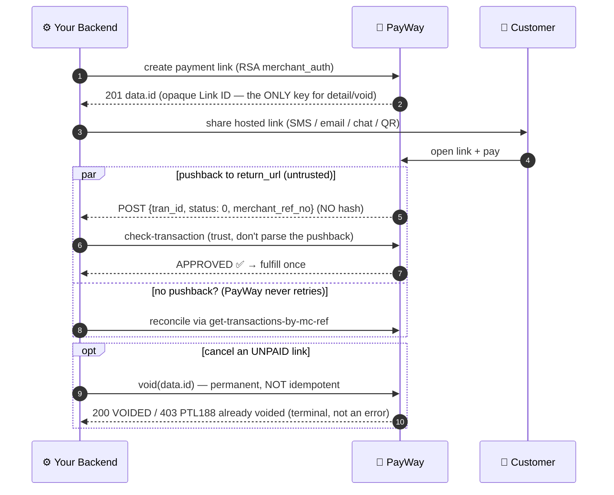

# 17. Payment Link API — Complete Implementation Guide

> Payment links are shareable hosted checkout URLs — no website needed. Create a link with an exact amount, send it by SMS, email, chat, or QR, and PayWay notifies your server when it is paid. This chapter covers the full lifecycle: create → share → pushback → reconcile → refunds.
>
> **Choosing a route:** see `aba-payway-first-payment` — a payment link fits when you collect a *known amount* from a customer *outside* your own checkout (invoices, live-stream sales, support-desk collections). QR / checkout fit when the customer is already in your app.

## Flow at a glance



## 17.1 Prerequisites

| Requirement | Notes |
|---|---|
| RSA `publicKeyPem` | Payment Link endpoints REQUIRE the RSA public key (merchant_auth is RSA-encrypted). Sandbox: provided with the sandbox account. Missing → `PayWayConfigError` before any call. |
| `merchant_id` + `api_key` | Standard credentials (see docs/02 for precedence). |
| A public HTTPS receiver | `return_url` must be public HTTPS (localhost/private hosts rejected unless `allowPrivateCallbackHosts: true`). It receives the payment pushback as `POST` with `Content-Type: application/json`. |

Pre-flight the key: `isValidPublicKeyPem()` (exported) — a malformed PEM throws a clear `PayWayConfigError` at call time anyway.

## 17.2 Creating a link

```ts
import { PayWay } from 'aba-payway-ts';

const payway = new PayWay();
const link = await payway.paymentLink.create({
  title: 'Invoice INV-2026-041',
  amount: 49.5,
  currency: 'USD',                       // REQUIRED by the gateway (defaults 'USD')
  merchantRefNo: 'INV-2026-041',         // echoed in the pushback
  returnUrl: 'https://merchant.example/payway/pushback',
  description: 'Website retainer — March',
  paymentLimit: 1,                       // one payment only; omit = unlimited
  expiredDate: Math.floor(Date.now() / 1000) + 7 * 86400, // epoch seconds, optional
});
const shareUrl = link.data?.payment_link;  // ← send this to the customer
const linkId = link.data?.id;             // ← save for getDetails (NOT the URL slug)
```

### Parameter reference (create)

| SDK param | Wire field | Type | Required | Constraints & behavior |
|---|---|---|---|---|
| `title` | `title` | string | yes | non-empty (throws); >250 chars **warns** (strict → throw) |
| `amount` | `amount` | number | yes | >0; USD ≤2dp, KHR integer (throws); below 0.01 USD / 100 KHR floor **warns** |
| `currency` | `currency` | `'USD' \| 'KHR'` | gateway-required | defaults `'USD'`; omitting it in the raw API answers PTL04 (sandbox-verified, undocumented) |
| `merchantRefNo` | `merchant_ref_no` | string | SDK-required | non-empty (throws — stricter than the official "optional"); ≤50 chars **warns** (strict → throw); gateway does NOT reject duplicates — uniqueness is your job |
| `returnUrl` | `return_url` | string | yes | public HTTPS (throws otherwise); base64-encoded automatically by the SDK |
| `description` | `description` | string | no | >250 chars **throws** (sandbox-verified PTL04) |
| `paymentLimit` | `payment_limit` | number | no | max number of payments; unset = unlimited; link flips to `PAID` when `total_trxn == payment_limit` |
| `expiredDate` | `expired_date` | number | no | epoch seconds; unset = no expiry. Gateway rejects past values and offsets < ~5 min (PTL04, sandbox-verified); after expiry the link still reads OPEN — enforce expiry yourself |
| `payout` | `payout` | `{acc, amt}[]` \| pre-encoded string | no | see §17.5 |
| `image` | `image` (multipart) | `PaymentLinkImage` | no | see §17.6 |

**Datatype reality check** (the official docs declare several of these as `string`; the PHP samples and live gateway accept/pass numbers — the SDK uses `number` everywhere): `amount`, `payment_limit`, `expired_date`, response `tran_id` (declared string, observed integer — coerce, don't rely on the type).

**Validation philosophy:** throws = will-fail-anyway contract violations; warns = advisory (the gateway is the final arbiter), escalated to throws under `strictValidation: true` / `PAYWAY_STRICT_VALIDATION=1`.

### Response

```jsonc
{
  "status": { "code": "00", "message": "Success!" },
  "tran_id": 1681357410,              // number | string — coerce
  "data": {
    "id": "UD/8Hl…Ht1xQdhlw==",       // opaque Link ID → getDetails; NOT merchant_ref_no, NOT the URL slug
    "title": "…", "amount": "0.03",  // amount arrives as a STRING here
    "currency": "USD", "status": "OPEN",
    "image": { "image": "", "filename": "", "size": 0 },   // empty shape when no image (size: 0 quirk — see §17.6)
    "payment_limit": 5, "total_amount_org": 0, "total_refund": 0,
    "total_amount": 0, "total_trxn": 0,
    "created_at": "2023-04-13 03:43:30", "updated_at": "…",
    "expired_date": 1681357409, "return_url": "https://… (decoded)",
    "merchant_ref_no": "ref00001", "outlet_id": "…", "outlet_name": "…",
    "payout": [],
    "payment_link": "https://link-sandbox.payway.com.kh/JT4630l"  // ← share this
  }
}
```

## 17.3 Inspecting a link

```ts
const details = await payway.paymentLink.getDetails(linkId);  // the data.id — NOT merchant_ref_no
```

Status lifecycle:

- **`OPEN`** — `payment_limit > total_trxn` (or no limit); payments still accepted.
- **`PAID`** — `payment_limit == total_trxn`; the hosted page stops accepting payments. A link **without** `payment_limit` never reaches PAID. Refreshing a paid link's share URL shows the customer **"Payment link is no longer valid — Contact to seller for support."** (sandbox-verified 2026-09-13). Note: `detail` may still report `status: "OPEN"` right after the payment lands while `total_trxn`/`total_amount` already reflect it — branch on the totals, not the `status` string.
- **`VOIDED`** — the link was permanently cancelled via the void endpoint (below); it can no longer receive payments. The hosted page answers HTTP 200 but renders an invalid-data shell (SSR state `page:"invalid-data"`, code `07`) — the customer-facing form is dead, unlike expiry which leaves it up (SANDBOX-FINDINGS §23).
- **No EXPIRED status exists — expiry is advisory** (sandbox-verified 2026-09-06): after `expired_date` passes, `detail` still reports `status: "OPEN"` and the hosted page still answers HTTP 200. Enforce expiry on your side (check `expired_date` against the clock before fulfilling), exactly like purchase lifetimes (W4-1). Per the ABA-bot relay (2026-10-03), the docs DO claim server-side enforcement in production ("requests after expiry must be rejected") with no documented error code, hosted-page state, or detail status for the expired case — the bot classifies our sandbox observation as sandbox-defective. Either way the merchant-side check stays mandatory; treat the production-enforcement claim as unverified intent.
- `expired_date` constraints (sandbox-verified): **past values and offsets under ~5 minutes are rejected at create with PTL04**; ≥ +300s accepted (number or string). Unset links echo `"0"` (string) in detail.

Totals semantics: `total_amount_org` = gross collected; `total_refund` = refunded; `total_amount` = after refunds; `total_trxn` = completed payment count. Per-transaction reconciliation: take `tran_id` from each pushback → `check-transaction` / `transaction-detail` (see docs/12).

## 17.4 Voiding a link

**UNDOCUMENTED endpoint — the full contract is live-verified on the sandbox (SANDBOX-FINDINGS §23, 2026-09-11):** `POST /api/merchant-portal/merchant-access/payment-link/void`. Permanently cancels an unpaid link; it can no longer receive payments and **the action cannot be reversed**.

```ts
await payway.paymentLink.void(linkId);   // same id as detail — create's data.id
// → { status: { code: "00", message: "Success.", lang, trace_id }, tran_id: <number> }
```

- **Signs exactly like detail**: RSA-encrypted `merchant_auth = {mc_id, id}`, hash over `request_time + merchant_id + merchant_auth`. Content-Type is lenient (JSON and urlencoded both accepted); the SDK sends urlencoded.
- **NOT idempotent** — a second void answers HTTP 403 `PTL188` "The payment link is already voided." Treat PTL188 as "already in the desired terminal state", not a failure.
- **Bogus link id** → HTTP 403 code `96` "Invalid merchant data" (same unknown-id signal as detail; the documented PTL132 was not reproduced).
- After a successful void, `detail` reports `status: "VOIDED"` with an advanced `updated_at`; `total_trxn`/`total_amount` stay 0 (an unpaid link has nothing to reverse — use refunds only for paid transactions).
- **Irreversible, single-attempt transport**: the endpoint is in the SDK's `MUTATION_ENDPOINTS` set — a lost response is never auto-retried (the outcome would be unknown).
- **Untested edges** (open in §23): whether a paid or partially-paid link can be voided, and whether in-flight payments still push back after a void. Don't void paid links — refund instead.
- CLI: `npx tsx src/cli.ts payment-link void -i <link-id> [-y] [--json]` — prompts on a TTY (irreversible), `-y`/`--json` skip the prompt; PTL188 surfaces the standard `{error:{paywayCode:'PTL188',…}}` envelope with exit 2.

## 17.5 Split payout

`payout` splits the collected amount to whitelisted beneficiary accounts the moment the link is paid. It travels **inside** the RSA-encrypted `merchant_auth` — invisible to schema readers, which is why it's easy to miss.

```ts
await payway.paymentLink.create({
  …,
  amount: 150,
  payout: [
    { acc: '000111222', amt: 100 },   // {acc, amt} — purchase-path keys
    { acc: '000999888', amt: 50 },    // NOT {account, amount} (that's the standalone payout domain)
  ],
});
```

Rules (all pinned by tests):

- **Total `amt` must equal `amount`** — documented gateway rule. SDK: **warn** by default, throw under `strictValidation`; CLI `--payout`: **hard exit 1** before the network (the CLI knows both values and the mismatch is always a caller error).
- Entry shape `{acc, amt}` is validated locally — malformed entries throw `PayWayConfigError` (shared `validatePayoutEntryShape`, same validator as the CLI).
- Payout **currency follows the link currency** — no per-entry currency.
- Beneficiaries must be **whitelisted** beforehand (`beneficiary add` / `addBeneficiary()`); non-whitelisted → gateway 403 "Payout accounts are not in whitelist" (e.g. `000999888` is NOT in the sandbox whitelist — use the seeded accounts from `sandbox-beneficiaries`).
- Pre-encoded payout strings pass through unvalidated (the SDK can't total them).
- The response resolves each entry with `acc_name` (sandbox evidence pending on the exact placement of `payout` in the response — top-level per apidog schema, inside `data` per ABA's own sample; verification item V-2).
- **Beneficiaries are paid at completion, not T+N** — split instructions settle to the whitelisted accounts the moment the link is paid (integration team, 2026-09-12). Production requires beneficiary whitelisting AND the payout service enabled on the MID (sandbox: code 32 "Service is not enable" until provisioned — Q19).
- **No standard refund after payout/split** — once a transaction is processed via payout/split, the refund API is not available; refunds are handled manually, or via pre-auth refund before the split (integration team, 2026-09-12). See [Chapter 20](20-settlement-and-disputes.md).

## 17.6 Images

```ts
import { readFileSync } from 'node:fs';
await payway.paymentLink.create({
  …,
  image: { data: readFileSync('./brand.jpg'), filename: 'brand.jpg', contentType: 'image/jpeg' },
});
```

- **≤3MB, JPG/JPEG/PNG** (spec). SDK: over-limit/bad-type **warns** (strict → throw); CLI `--image`: extension + size **hard-exits 1** at load time.
- **Two more documented constraints (ABA-bot relay 2026-10-03):** image **width must not exceed 2,000 pixels**, and the **filename must not contain special characters such as parentheses**. The SDK/CLI do not enforce these yet — validate before upload.
- The image travels as a top-level multipart part — **never inside merchant_auth, never hashed** (hash still covers only `request_time + merchant_id + merchant_auth`). The SDK switches the wire to multipart automatically when `image` is present.
- Sandbox quirks (SANDBOX-FINDINGS §15): the gateway re-hosts uploads on its CDN and **renames** them (`payment_link_image_<epoch-ms>.<ext>`), and the echoed `image.size` reads **0** regardless of true size — don't build logic on it. Links without an image echo the empty shape `{"image":"","filename":"","size":0}`.

## 17.7 Handling the payment pushback

When a payment completes on the link, PayWay POSTs to your decoded `return_url`. **Live-captured contract (2026-09-06, real sandbox payment through a trycloudflare receiver):**

```json
POST /pushback
Content-Type: application/json; charset=utf-8
User-Agent: PayWayApp/3.0

{ "tran_id": "178865526240157", "status": 0, "merchant_ref_no": "plvr-v1-mtp34wx4" }
```

- **There is NO `hash` field — confirmed live (twice, 2026-09-06 and 2026-09-13).** And no hash in the **headers** either — a full-header capture shows only `User-Agent: PayWayApp/3.0`, `Content-Type: application/json; charset=utf-8`, W3C `traceparent` tracing, and CDN hops; no signature header of any kind. The pushback is a *notification only*: verify the payment with `check-transaction` using the pushed `tran_id` before fulfilling (that call is what carries the gateway's signed status). `verifyCallback()` does not apply here.
- `status` arrives as the **numeric `0`** (APPROVED), not the `"00"` string the official overview sample shows — accept both.
- `tran_id` is a string here (though numeric-typed in the create/detail responses) — coerce.
- One pushback per payment: a multi-payment link (payment_limit > 1) fires one per completion.
- **`return_url` is pushback-only — the customer is NEVER redirected there** (sandbox-verified 2026-09-13, tunneled receiver on a real payment: zero browser hits after approval). There is **no `continue_success_url`** on the payment-link API (unlike purchase) and no other redirect hook. A post-payment "next step" page must be driven from your pushback handler, not the link.
- The receiver must answer 200 quickly; ACK first, process after (the sample receiver below does exactly that).
- **SDK helper:** `parsePaymentLinkPushback(rawBody)` (exported) parses/coerces the body — `status` numeric `0`/`"0"`/`"00"` → `'APPROVED'`, anything else `'UNKNOWN'` (raw preserved), `tran_id` coerced to string. The built-in webhook server's `/aba-payway-pushback` route uses it, so `payway-sdk setup-webhook` can host your pushback receiver too.

```ts
// Express-style receiver
app.post('/payway/pushback', express.json(), async (req, res) => {
  res.sendStatus(200);                      // ACK immediately
  const check = await payway.checkout.checkTransaction(req.body.tran_id);
  if (check.data?.payment_status === 'APPROVED') markInvoicePaid(req.body.merchant_ref_no);
});
```

## 17.8 CLI quick reference

```sh
# Create (all optional flags shown)
npx tsx src/cli.ts payment-link create -t "Invoice INV-041" -a 49.50 -c USD \
  -r INV-2026-041 --return-url https://merchant.example/pushback \
  -d "Website retainer" --payment-limit 1 --expired-date 1783000000 \
  --payout '[{"acc":"500000001","amt":49.50}]' --image ./brand.jpg \
  [--no-show-qr] [--json]

# Inspect — -i takes the Link ID from create's data.id
npx tsx src/cli.ts payment-link detail -i "UD/8Hl…==" [--json]

# Void (permanent, irreversible) — prompts on a TTY; -y or --json skips the prompt
npx tsx src/cli.ts payment-link void -i "UD/8Hl…==" [-y] [--json]
```

- `--json` prints the raw response on success; on ANY failure (local validation or gateway rejection) it prints the machine-parseable envelope `{ "error": { kind, exitCode, type, message, paywayCode, … } }` — branch on the envelope, never on stdout text. Exit codes: 0 ok, 1 validation, 2 API failure, 3 network.
- `--payout` accepts inline JSON or a plain string; total must equal `-a` (local exit 1).
- `--image` rejects non-JPG/JPEG/PNG extensions and >3MB files locally.
- On a TTY, create renders a terminal QR of the share URL; `--no-show-qr` suppresses (same flag as generate-qr/generate-checkout).

## 17.9 Error codes

| Code | Meaning | SDK hint |
|---|---|---|
| `PTL02` | Wrong hash | hash order `request_time.merchant_id.merchant_auth` (the image is never hashed) |
| `PTL04` | Parameter validation required | currency/return_url missing, description >250, non-numeric amount, **or an expired_date in the past / under ~5 min out** — *sandbox-discovered, not in official docs* |
| `PTL05` | Parameter invalid format | check datatypes (sandbox probes: malformed values answered PTL04 instead — PTL05 not yet reproduced) |
| `PTL99` | Merchant invalid currency | currency not enabled for the merchant profile (sandbox probe: EUR answered PTL04 — PTL99 not yet reproduced on this profile) |
| `PTL132` | Invalid payment link (detail, officially documented) | wrong `id` — you passed the merchant ref or URL slug, not `data.id`. NOT reproduced on this sandbox profile (2026-09-06): a bogus id answers **96** instead |
| `PTL188` | The payment link is already voided (void, **sandbox-verified §23**) | not a failure — already in the desired terminal state; `detail` reads `VOIDED`. Void is not idempotent |
| `96` | (detail/void) invalid link id — **sandbox-observed** | check the Link ID (HTTP 403 "Invalid merchant data") |
| 37 / `PTL146` / `PTL46` | Payout account not whitelisted | `beneficiary add <acc>` first |
| `PTL147` / 12 | Payout currency mismatch | payout follows the link currency |

All surface as `PayWayAPIError`/`PayWayBusinessError` with `paywayCode` set; `payway-sdk explain <code>` decodes them.

## 17.10 Permutations & recipes

| Recipe | Parameters |
|---|---|
| **Invoice billing** | exact amount + `merchantRefNo`=invoice no + `paymentLimit: 1` + pushback receiver → mark paid on APPROVED |
| **Live-stream selling** (ABA's own example) | exact amount per buyer message, share `payment_link` in chat, optionally short `expiredDate` |
| **Marketplace split** | `payout [{acc, amt}]` totaling the amount; whitelist beneficiaries first |
| **Limited-quantity drop** | `paymentLimit` = stock; poll `detail` until `status: "PAID"` — the hosted page enforces the stop |
| **Pre-order window** | `expiredDate` = window end; treat post-expiry attempts as closed (merchant-side rule — no EXPIRED status exists) |
| **Donation drive** | no payment_limit, fixed amount; `total_trxn`/`total_amount` are your running totals |
| **Branded link** | `image` JPG/PNG ≤3MB (CDN rename + size:0 quirks apply) |
| **Field collection** | CLI one-liner + TTY QR → show the customer a scannable link |
| **KHR cash collection** | `currency: 'KHR'`, integer amount ≥100; payout entries are KHR too |
| **Refund on a paid link** | refund per `tran_id` via the refund API; the link's `total_refund`/`total_amount` adjust, `status` reflects the payment_limit rule |
| **Cancel a mistaken link** | `void(linkId)` (unpaid links only — irreversible, PTL188 if already voided; §17.4) — don't just delete the message, the URL keeps working until voided |

## 17.11 Troubleshooting

- **"Wrong hash" (PTL02)** on a request with an image → the image must never enter the hash; the SDK handles this — you're likely hand-rolling the request. Use `paymentLink.create()`.
- **Private-host returnUrl rejected** → intentional guard; `allowPrivateCallbackHosts: true` (or `PAYWAY_ALLOW_PRIVATE_CALLBACK_HOSTS=1`) to un-gate for local tests.
- **PEM with literal `\n`** → normalized automatically (pinned test); keep real newlines where possible.
- **Detail fails with 96 / PTL132 but the link works in the browser** → you're passing the URL slug or merchant_ref_no; use the opaque `data.id` from create (sandbox answers 96 for a bogus id).
- **Payout total warning at create** → Σamt ≠ amount; the CLI hard-rejects, the SDK warns (strict throws).
- **Pushback never arrives** → receiver must accept POST + `application/json` and answer 200; check it's publicly reachable.
