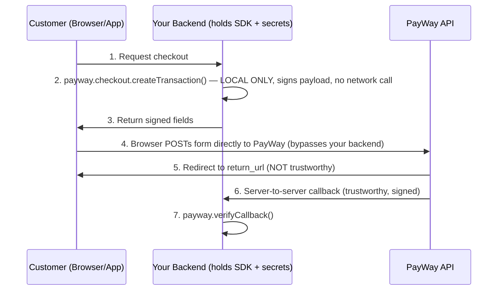

Updated todo list

Read memory [](file:///c%3A/Users/syed.sohailmehdi/AppData/Roaming/Code%20-%20Insiders/User/workspaceStorage/3c324a4c3e486910680e094e528b835d/GitHub.copilot-chat/memory-tool/memories/repo/payway-sdk-review.md)

Read memory

Read [](file:///d%3A/Antigravity_google/SDK-prepration/src/client.ts#1-1), lines 1 to 700

Read [](file:///d%3A/Antigravity_google/SDK-prepration/README.md)

Read [](file:///d%3A/Antigravity_google/SDK-prepration/src/types.ts#1-1), lines 1 to 400

Read [](file:///d%3A/Antigravity_google/SDK-prepration/docs/04-native-app-implementation.md#1-1), lines 1 to 500

Read [](file:///d%3A/Antigravity_google/SDK-prepration/docs/08-deep-linking.md)

Read [](file:///d%3A/Antigravity_google/SDK-prepration/docs/11-callbacks-and-webhooks.md)

Read [](file:///d%3A/Antigravity_google/SDK-prepration/docs/07-qr-code-handling.md)

Read [](file:///d%3A/Antigravity_google/SDK-prepration/docs/02-prerequisites-and-setup.md#1-1), lines 1 to 300

Read [](file:///d%3A/Antigravity_google/SDK-prepration/docs/01-overview-and-concepts.md)

Read [](file:///d%3A/Antigravity_google/SDK-prepration/docs/13-deployment-checklist.md#1-1), lines 1 to 250

Read [](file:///d%3A/Antigravity_google/SDK-prepration/payway-openapi/openapi.yaml)

Read [](file:///d%3A/Antigravity_google/SDK-prepration/PROJECT_STATUS.md#1-1), lines 1 to 150

Read [](file:///d%3A/Antigravity_google/SDK-prepration/New%20folder)

Read [](file:///d%3A/Antigravity_google/SDK-prepration/SANDBOX-FINDINGS.md)

Read [](file:///d%3A/Antigravity_google/SDK-prepration/payway-openapi/components/webhooks.yaml)

Searched for text `PaymentCallbackBody` (`**/payway-openapi/**`), 2 results

Read [](file:///d%3A/Antigravity_google/SDK-prepration/src/auth.ts)

Read [](file:///d%3A/Antigravity_google/SDK-prepration/src/constants.ts)

Searched for text `verifyCallback|X-PAYWAY-HMAC|req.body.hash|callback_url|callbackUrl", "hash"` (`**/src/**`), 44 results

Read [](file:///d%3A/Antigravity_google/SDK-prepration/payway-openapi/components/schemas/ecommerce-checkout.yaml#260-260), lines 260 to 330

Read [](file:///d%3A/Antigravity_google/SDK-prepration/src/client.ts#700-700), lines 700 to 1292

Searched for text `multipart|content:|requestBody|x-hmac-fields` (`**/payway-openapi/paths/ecommerce-checkout.yaml`), 30 results

Read [](file:///d%3A/Antigravity_google/SDK-prepration/docs/09-link-unlink-renew-lifecycle.md#1-1), lines 1 to 120

No matches found. Your search pattern might be excluded completely by either the search.exclude settings or .*ignore files.
If you believe that it should have results, you can check into the .*ignore files and the exclude setting (here are some excluded patterns for reference:[**/node_modules,**/bower_components,**/*.code-search]).
Then if you want to include those files you can call the tool again by setting "includeIgnoredFiles" to true.

Read [](file:///d%3A/Antigravity_google/SDK-prepration/payway-openapi/paths/ecommerce-checkout.yaml#1-1), lines 1 to 50

No matches found. Your search pattern might be excluded completely by either the search.exclude settings or .*ignore files.
If you believe that it should have results, you can check into the .*ignore files and the exclude setting (here are some excluded patterns for reference:[**/node_modules,**/bower_components,**/*.code-search]).
Then if you want to include those files you can call the tool again by setting "includeIgnoredFiles" to true.

Read [](file:///d%3A/Antigravity_google/SDK-prepration/docs/05-webview-implementation.md#1-1), lines 1 to 150

Searched for text `view_type|viewType|popup|iframe` (`**/*.md`), 16 results

Searched for regex `purchase|checkoutUrl|abapay_khqr_deeplink` (`**/src/**`), 50 results

Searched for text `GenerateQrResponse` (`**/src/types.ts`), 2 results

Read [](file:///d%3A/Antigravity_google/SDK-prepration/src/types.ts#960-960), lines 960 to 1010

Searched for text `abapay_deeplink|checkout_qr_url|fetch|purchase` (`**/docs/14-appendix-code-snippets.md`), 3 results

Updated memory file [](file:///c%3A/Users/syed.sohailmehdi/AppData/Roaming/Code%20-%20Insiders/User/workspaceStorage/3c324a4c3e486910680e094e528b835d/GitHub.copilot-chat/memory-tool/memories/repo/payway-sdk-review.md)

# ABA PayWay TypeScript SDK — Senior Payment Integration Review

*Reviewed: client.ts, auth.ts, types.ts, constants.ts, README.md, the full docs guide (14 chapters), openapi.yaml, SANDBOX-FINDINGS.md, and PROJECT_STATUS.md.*

---

## 1. Executive Summary

| Dimension | Verdict |
|---|---|
| **Completeness of coverage** | Strong for card/QR/tokenized e-commerce. **Weak/absent for POS and true native-app deep linking** — see gaps below. |
| **Ease of use** | Good abstraction of HMAC/RSA signing (the hardest part of PayWay integration). Field-ordering and encoding quirks are hidden from the developer. However, **the docs and the OpenAPI spec disagree with each other on two load-bearing details** (webhook signature location, form content-type), which will cause real integration bugs if followed literally. |
| **Production readiness** | Solid crypto layer, good test coverage (90 tests), but several endpoints are "spec-only" (never hit sandbox) and one commonly-needed capability — getting a real ABA Pay deeplink — is not actually implemented end-to-end. |

The SDK is well-architected as a **signing/verification library**, not a full API client — several "creation" methods (notably `checkout.createTransaction`) never call the network; they just build and sign a payload for you (or your frontend) to submit. That distinction matters a lot for the native-app scenario, detailed in §4.3.

---

## 2. Architecture You Must Understand First



Key fact that shapes everything below: **this SDK is server-only** (README.md security warning) — a native app or POS terminal can never hold `apiKey`/RSA key directly. Every scenario below requires your own backend as a proxy.

---

## 3. Step-by-Step Integration Guide (Common Foundation)

### Step 1 — Get credentials (docs/02)
- `merchantId` (e.g. `ec476910`) — not secret.
- `apiKey` — secret, used for HMAC-SHA512 signing of every request.
- `publicKeyPem` (RSA, 1024-bit) — only required for **Refund, Pre-Auth, Payout, Payment Link**. Not needed for basic checkout/QR/CoF.
- Separate credential sets for sandbox vs. production — confirm both before go-live.

### Step 2 — Install & initialize
```bash
npm install aba-payway-ts
```
```typescript
const payway = new PayWay({
  merchantId: process.env.PAYWAY_MERCHANT_ID!,
  apiKey: process.env.PAYWAY_API_KEY!,
  publicKeyPem: process.env.PAYWAY_PUBLIC_KEY_PEM, // omit if you don't need refund/pre-auth/payout/payment-link
  environment: 'sandbox',
});
```
Store all three in environment variables / a secrets manager — never in source. Rotate the `apiKey` per-environment; treat leakage as a full compromise since it's used for both signing outbound requests and verifying inbound webhooks.

### Step 3 — Expose a webhook endpoint
Every flow (redirect, QR, CoF, POS) depends on this. See §5 (Callback Management) — do this **before** building any payment flow, and tunnel it with ngrok in dev (docs/02).

### Step 4 — Pick your flow per scenario (below).

---

## 4. Scenario-by-Scenario Assessment

### 4.1 E-Commerce Website (redirect / embedded)

**Suitability: Good.** This is the SDK's best-supported scenario.

**Integration steps:**
1. Backend: `payway.checkout.createTransaction({ transactionId, amount, currency, items, returnUrl, cancelUrl, paymentOption })` — returns a signed field object (no network call).
2. Frontend: render an auto-submitting `<form method="POST" action="{sandboxBaseUrl}/api/payment-gateway/v1/payments/purchase">` with those fields as hidden inputs, and submit it — see docs/03 and docs/14.
3. For an in-page modal instead of full redirect, set `viewType: 'popup'` (docs/10) — this is PayWay's own popup overlay, **not** a merchant-embeddable iframe (no iframe example exists in the repo — see Gap #6).
4. Customer pays on PayWay's hosted page → redirected to `returnUrl` (cosmetic only) → your webhook fires with the real result (§5).
5. On your `returnUrl` handler, look up the transaction via `payway.checkout.checkTransaction(tranId)` or just wait for the webhook — never mark "paid" from the redirect alone.
6. Refunds: `payway.checkout.refund(tranId, amount)` — requires `publicKeyPem`, only works on COMPLETED transactions, within 30 days.

**Roadblocks/gaps for this scenario:**
- Webhook signature contract is ambiguous (§6.1) — resolve **before** writing your handler, or your webhook will silently reject every real callback (or worse, accept forged ones if you build a lenient stand-in).
- `purchase`'s declared content-type (`multipart/form-data`) doesn't match any of the example forms in the repo (`application/x-www-form-urlencoded` by omission of `enctype`) — verify against sandbox before shipping (§6.2).
- No documented example of true iframe embedding (only full redirect and PayWay's own popup) — if a seamless embedded checkout is a hard requirement, budget time to test this yourself against sandbox.

### 4.2 POS / Cashier System

**Suitability: Weak — no purpose-built POS flow exists.** You'll be repurposing e-commerce primitives.

**Realistic integration path (closest fit is dynamic QR):**
1. Cashier's terminal app calls your backend to create a sale; backend calls `payway.qr.generateQr({ transactionId, amount, paymentOption: 'abapay_khqr', currency, callbackUrl })` — this is a **real API call** (unlike `checkout.createTransaction`) and returns `qrString` + `qrImage` (docs/07).
2. Display `qrImage` (base64 PNG) on the terminal screen for the customer to scan with any KHQR-compatible banking app.
3. Confirm payment via the webhook (`callbackUrl`) — **not** by polling, though a short client-side poll of `checkTransaction` is a reasonable UX fallback while waiting for the webhook.
4. Void an unpaid sale before the customer pays: `payway.checkout.closeTransaction(tranId)`.
5. Refund at the counter: `payway.checkout.refund(tranId, amount)` (requires RSA key, 30-day window, COMPLETED only).

**Critical roadblocks/missing logic for POS specifically:**
- **No terminal/cashier/device identity model anywhere in the API.** There's no `terminalId`/`cashierId` concept — every terminal shares the same `merchantId`/`apiKey`. You must invent your own attribution scheme (e.g., encode terminal/cashier into `tran_id` or `custom_fields`) since PayWay gives you nothing to reconcile "which till took this payment" natively.
- **Reconciliation endpoints are rate-capped in ways that don't fit multi-terminal retail:** `transaction-list-2` is hard-capped to a **3-day date range** and 50 req/min; `transaction-detail` is hard-capped to **10 req/min "cannot be increased"** per PayWay's own docs (SANDBOX-FINDINGS.md). A busy multi-lane store doing real-time end-of-day reconciliation across many terminals will hit these limits fast — there's no bulk/webhook-driven ledger export documented.
- **Offline/no-connectivity mode is a dead end for POS.** `payway.khqr.generateOfflineQR()` looks tailor-made for a POS counter, but it's explicitly **not trackable by PayWay** (README.md warning) — no webhook, no status check. Using it means you have no automated way to know the customer actually paid; you'd be relying on manual bank statement reconciliation. Don't use it for anything requiring automatic confirmation.
- No guidance anywhere on **cash-plus-card split tender, partial payment, or held/parked orders** — common POS requirements — you'll need to build this entirely yourself on top of `tran_id` bookkeeping.
- No printed-receipt or ESC/POS integration guidance (unsurprising for a payment SDK, but worth flagging since "cashier terminal" often implies a receipt printer needs the same QR/transaction reference).

**Recommendation:** Treat POS as a thin wrapper around the QR flow, build your own terminal/cashier/session layer entirely in your own database, and pilot the reconciliation rate limits against your expected transaction volume before committing to this path at scale.

### 4.3 Native Mobile App (Deep Linking)

**Suitability: Documented conceptually, but the actual deep-link mechanism is not implemented end-to-end in this SDK.** This is the weakest area, and worth reading carefully before you build against it.

**What the docs describe** (docs/04, docs/08):
- Recommended pattern: backend generates a signed checkout payload → app loads it in a WebView pointing at PayWay's hosted checkout → app intercepts the `returnUrl` redirect → app calls your backend to verify real status (never trust the WebView redirect).
- For a "real" deep link that jumps straight into the **ABA Pay app** (not a WebView), the docs describe setting `paymentOption: 'abapay_khqr_deeplink'` and passing `returnDeeplink: { ios_scheme, android_scheme }`.

**What actually happens in the code — the critical gap:**
- `payway.checkout.createTransaction()` is a **pure local signer** — it has no corresponding entry in constants.ts's `ENDPOINTS` and makes **no HTTP request**. Per the OpenAPI spec itself (openapi.yaml, info.description item 5), the `purchase` endpoint's response is *polymorphic*: HTML for normal checkout, but **JSON containing `qr_string`, `abapay_deeplink`, `checkout_qr_url`** when `payment_option=abapay_khqr_deeplink`. A browser form-POST/navigation (the only mechanism the SDK's docs describe) cannot hand a JSON response back to your native app in a usable way — you need a genuine server-side (or XHR) POST to `purchase` to get that JSON, and **no method in the SDK does this or parses that response shape.**
- The other API call that *does* actually hit the network — `payway.qr.generateQr()` — only returns `{ qrString, qrImage }` (types.ts `GenerateQrResponse`). **No `abapay_deeplink` field exists in that response either.**
- **Net result: as of this review, there is no working code path in the SDK that returns a real ABA Pay app deeplink URI.** docs/08 even flags the URI scheme itself as `[TBD: confirm with ABA]` — it's speculative, not verified.

**What this means for your integration:**
1. If you only need "open a checkout page inside my app" — use the **WebView pattern** from docs/04; this works today and is well-documented (form-POST payload from `createTransaction()`, load in WebView, intercept the `returnUrl` prefix, verify status via your backend).
2. If you need a **true one-tap deep link into the ABA Pay app**, you must build the missing piece yourself: add a backend method that performs a raw signed POST to `/api/payment-gateway/v1/payments/purchase` with `payment_option: 'abapay_khqr_deeplink'`, parses the JSON response for `abapay_deeplink`/`checkout_qr_url`, and returns that to your app. Budget time to verify this against sandbox — it is unverified in this codebase ("everything in [QR/deeplink-adjacent] domains is still spec-only/unverified" per SANDBOX-FINDINGS.md).
3. Handling the return: register your app's own custom URL scheme (`myapp://payment-result`) via `returnDeeplink`, handle it in `AppDelegate`/`SceneDelegate` (iOS) or an intent-filter Activity (Android) per docs/08, and **always re-verify status via your backend** — never trust deep-link query parameters as proof of payment (the doc is explicit and correct about this).
4. Always provide a fallback: if the ABA Pay app isn't installed, fall back to the WebView/QR flow — docs/08 shows a (fragile, `document.hasFocus()`-based) detection pattern; test this on real devices, not simulators.

---

## 5. Where to Manage Callbacks

- **One mechanism, dual purpose confusion.** The **only** trustworthy signal is the server-to-server callback — sent to whatever URL you configure. For checkout, that's implicitly your `returnUrl`/profile default (per the OpenAPI webhook spec); for QR (`payway.qr.generateQr`) and CoF (`linkAccount`/`linkCard`/`payment`), it's an explicit `callbackUrl` parameter you pass per-request. **These can be the same physical endpoint** in your backend, but you should design your handler to accept both shapes (see §6.1 on the field-name conflict).
- Register the endpoint with `app.use(express.json())` and route it separately from your public redirect page (`returnUrl` is browser-facing HTML; the callback is server-facing JSON) — docs/11 has a full Express example.
- Always: verify signature → respond `HTTP 200` within ~5 seconds → do heavy work (DB update, email, inventory) **after** responding → dedupe on `tran_id` (PayWay retries and can send duplicates).
- In dev, tunnel via ngrok — `localhost` is unreachable by PayWay's servers (docs/02).
- In production, switch the callback URL from ngrok to your real HTTPS domain **before go-live** (docs/13 checklist) — trivial to forget and easy to catch in code review.

## 6. Critical Gaps & Clarity Report

### 6.1 🔴 Webhook signature: body field vs. header (contradicts itself in-repo)
- **README.md / docs/11:** show extracting `req.body.hash`, deleting it, then calling `payway.verifyCallback(bodyWithoutHash, receivedHash)`.
- **webhooks.yaml + `PaymentCallbackBody` schema:** state the signature arrives in the **`X-PAYWAY-HMAC-SHA512` HTTP header**, and the callback body's required fields are `tran_id`, `apv`, `status` — **no `hash` field exists in the schema at all.**
- `verifyCallback()`/`verifyCallbackSignature()` in the SDK is agnostic (you supply the signature from wherever) — the SDK code itself isn't broken, but **following the written examples literally will build a handler that looks for a field that, per the spec, doesn't exist.** Confirm the real payload shape against a live sandbox callback before writing production code, and update whichever source is wrong.

### 6.2 🟠 Form content-type mismatch
OpenAPI declares `purchase` requires `multipart/form-data` (ecommerce-checkout.yaml); every code example in README/docs/03/04/05/14 builds a plain `<form>` with no `enctype`, which browsers send as `application/x-www-form-urlencoded`. Unverified against sandbox — test explicitly, since a real mismatch here would break e-commerce, WebView, and POS QR-adjacent flows simultaneously.

### 6.3 🔴 No working ABA Pay deeplink retrieval (detailed in §4.3)
`checkout.createTransaction()` never calls the network; `qr.generateQr()`'s response has no deeplink field. The one endpoint that *does* return `abapay_deeplink` (`purchase` with `abapay_khqr_deeplink`) has no corresponding SDK method. This is the single biggest blocker for the native-app deep-linking scenario.

### 6.4 🟠 `cancel_url`/encoding inconsistencies (carried over from prior review)
`cancel_url`, `continue_success_url`, `return_params` base64-encoding — already flagged/fixed per PROJECT_STATUS.md Task 1, but double-check test coverage explicitly asserts this if you touch checkout code again.

### 6.5 🟡 Error-handling contract is per-endpoint and only partially probed
Only Ecommerce Checkout, CoF, QR, Pre-auth, and Payout have been sandbox-verified (SANDBOX-FINDINGS.md); KHQR lookup returned HTTP 404 in the test sandbox profile and is effectively unverified/unusable there. `_executeFetch()` in client.ts only special-cases `!response.ok` for HTTP failures — confirmed correct for `check-transaction-2`/`close-transaction`/`transaction-list-2` (real 4xx), but not exhaustively confirmed for every domain.

### 6.6 🟡 No terminal/device/cashier identity primitive (POS-specific, detailed in §4.2)

### 6.7 🟡 No embeddable-iframe example for e-commerce (detailed in §4.1)
`viewType: 'popup'` exists but is PayWay's own popup, not a merchant-controlled iframe — if a true embedded/iframe checkout is a hard product requirement, this needs its own spike/validation against sandbox.

### 6.8 🟡 Test card numbers and production base URL are placeholders
docs/01 literally lists `[TBD: Obtain from ABA developer portal]` for test card numbers, and the OpenAPI spec notes the production host is "likely `checkout.payway.com.kh`, not verified here." Get both confirmed directly from ABA before scheduling a go-live date.

---

## 7. Bottom Line

Use this SDK as-is for **e-commerce redirect/QR flows** — that path is genuinely well-built, well-tested, and safe. Treat **POS** as "build your own layer on top of the QR primitive" rather than an out-of-the-box capability. For **native-app deep linking**, plan for extra engineering work: either accept the WebView fallback (works today) or budget time to implement and sandbox-verify the missing `purchase`-endpoint call yourself before committing to a true one-tap ABA Pay deep link in your roadmap. Resolve the webhook signature ambiguity (§6.1) before writing any production callback handler — it's the one gap that can silently break trust in every scenario at once.
