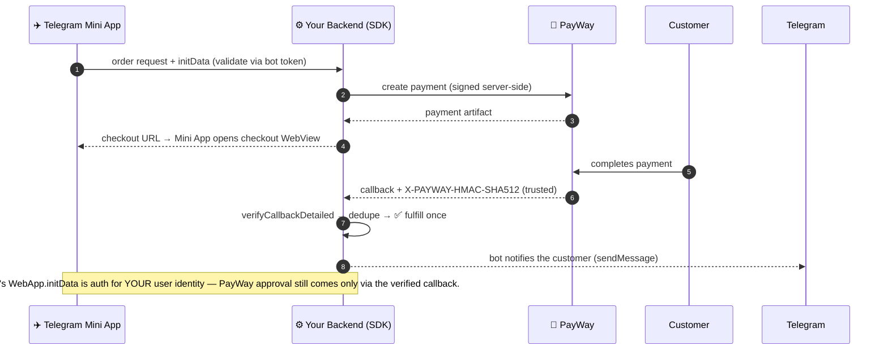

# Chapter 6 — Telegram Mini App Integration

> **Estimated reading time:** 10 minutes  
> **Goal:** Integrate ABA PayWay payments into a Telegram Mini App.

## Flow at a glance



---

## What Is a Telegram Mini App?

A Telegram Mini App is a web application that runs inside Telegram's built-in browser. Users access it through a Telegram Bot — the bot sends a button that opens your web app as an overlay within the Telegram client. Mini Apps have access to the **Telegram WebApp API** (`window.Telegram.WebApp`) for native-like interactions.

---

## Architecture

```
┌──────────────────────────┐     ┌──────────────────────────┐     ┌──────────────────────┐
│   Telegram Client        │     │   Your Backend (Node.js)  │     │   ABA PayWay API     │
│                          │     │                          │     │                      │
│  Mini App (WebView)      │◀───▶│   PayWay SDK generates    │────▶│   Handles payment    │
│  Telegram.WebApp API     │     │   signed checkout payload │◀────│   Sends callbacks    │
└──────────────────────────┘     └──────────────────────────┘     └──────────────────────┘
```

The flow is nearly identical to the web implementation (Chapter 3), with one key restriction: **no external popups or new windows**. Telegram's Mini App WebView does not allow `window.open()`.

---

## Key Restrictions in Telegram Mini Apps

| Restriction | Impact | Workaround |
|---|---|---|
| **No `window.open()`** | Cannot redirect to PayWay in a new tab/window | Load PayWay checkout in an iframe OR use the hidden form auto-submit |
| **No external browser navigation** | PayWay's checkout must stay within Telegram | Use inline form submission |
| **Limited screen size** | Mini Apps typically show in a half-screen overlay | PayWay's mobile-responsive checkout page handles this |
| **`Telegram.WebApp.close()` required** | Mini App doesn't close automatically after payment | Call `close()` in your result handling |

---

## Implementation

### Step 1: The Mini App HTML Page

This is a single HTML file served by your backend. It initializes the Telegram WebApp, calls your backend for a signed checkout payload, and handles the payment flow.

```html
<!-- telegram-mini-app.html -->
<!DOCTYPE html>
<html lang="en">
<head>
  <meta charset="UTF-8">
  <meta name="viewport" content="width=device-width, initial-scale=1.0, maximum-scale=1.0, user-scalable=no">
  <title>PayWay Payment</title>

  <!-- Required: Telegram WebApp script -->
  <script src="https://telegram.org/js/telegram-web-app.js"></script>

  <style>
    * { box-sizing: border-box; margin: 0; padding: 0; }

    body {
      font-family: -apple-system, BlinkMacSystemFont, 'Segoe UI', Roboto, sans-serif;
      background: var(--tg-theme-bg-color, #ffffff);
      color: var(--tg-theme-text-color, #0f0f10);
      padding: 20px;
    }

    .app {
      max-width: 480px;
      margin: 0 auto;
      text-align: center;
    }

    .logo {
      font-size: 3rem;
      margin-bottom: 16px;
    }

    h1 {
      font-size: 1.5rem;
      font-weight: 700;
      margin-bottom: 8px;
    }

    .description {
      color: var(--tg-theme-hint-color, #8e8e93);
      font-size: 0.9rem;
      margin-bottom: 24px;
    }

    .amount-card {
      background: var(--tg-theme-secondary-bg-color, #f7f7f8);
      border-radius: 12px;
      padding: 24px;
      margin-bottom: 24px;
    }

    .amount {
      font-size: 2.5rem;
      font-weight: 700;
    }

    .currency {
      font-size: 0.875rem;
      color: var(--tg-theme-hint-color, #8e8e93);
      text-transform: uppercase;
    }

    .btn {
      display: block;
      width: 100%;
      padding: 16px 24px;
      border: none;
      border-radius: 12px;
      font-size: 1rem;
      font-weight: 600;
      cursor: pointer;
      transition: opacity 0.2s;
    }

    .btn-primary {
      background: var(--tg-theme-button-color, #2ea6ff);
      color: var(--tg-theme-button-text-color, #ffffff);
    }

    .btn-primary:disabled {
      opacity: 0.5;
      cursor: not-allowed;
    }

    .spinner {
      display: inline-block;
      width: 20px;
      height: 20px;
      border: 2px solid var(--tg-theme-button-text-color, #ffffff);
      border-top-color: transparent;
      border-radius: 50%;
      animation: spin 0.6s linear infinite;
      margin-right: 8px;
      vertical-align: middle;
    }

    @keyframes spin {
      to { transform: rotate(360deg); }
    }

    .hidden {
      display: none !important;
    }

    .status-message {
      margin-top: 16px;
      font-size: 0.85rem;
      color: var(--tg-theme-hint-color, #8e8e93);
    }

    .status-message.error {
      color: #dc2626;
    }

    .payment-methods {
      display: flex; flex-direction: column; gap: 8px;
      margin: 24px 0;
    }

    .method-card {
      display: flex; align-items: center; gap: 12px;
      padding: 14px 16px;
      border: 2px solid var(--tg-theme-hint-color, #e5e7eb);
      border-radius: 10px;
      cursor: pointer;
      transition: border-color 0.2s;
      text-align: left;
    }

    .method-card.selected {
      border-color: var(--tg-theme-button-color, #2ea6ff);
    }

    .method-radio {
      width: 20px; height: 20px;
      border-radius: 50%;
      border: 2px solid var(--tg-theme-hint-color, #ccc);
    }

    .method-name {
      font-weight: 600;
    }

    .method-desc {
      font-size: 0.8rem;
      color: var(--tg-theme-hint-color, #8e8e93);
    }
  </style>
</head>
<body>
  <div class="app">
    <div class="logo">💳</div>
    <h1 id="title">Complete Payment</h1>
    <p class="description">Pay securely with ABA PayWay</p>

    <!-- Amount display -->
    <div class="amount-card">
      <div class="amount" id="displayAmount">$0.00</div>
      <div class="currency">USD</div>
    </div>

    <!-- Payment method selection -->
    <div class="payment-methods" id="paymentMethods">
      <div class="method-card selected" data-method="abapay_khqr">
        <div class="method-radio"></div>
        <div>
          <div class="method-name">ABA KHQR</div>
          <div class="method-desc">Scan to pay with any bank app</div>
        </div>
      </div>
      <div class="method-card" data-method="cards">
        <div class="method-radio"></div>
        <div>
          <div class="method-name">Credit / Debit Card</div>
          <div class="method-desc">Visa, Mastercard, UnionPay</div>
        </div>
      </div>
    </div>

    <!-- Pay button -->
    <button class="btn btn-primary" id="payButton">
      <span id="btnText">Pay Now</span>
      <span id="btnSpinner" class="spinner hidden"></span>
    </button>

    <!-- Status messages -->
    <div id="status" class="status-message"></div>
  </div>

  <!-- Hidden form for PayWay submission -->
  <form id="paywayForm" method="POST" target="_self" class="hidden">
    <!-- Fields populated dynamically -->
  </form>

  <script>
    (function() {
      // ============================================
      // Initialize Telegram Mini App
      // ============================================
      const tg = window.Telegram.WebApp;

      // Tell Telegram the Mini App is ready
      tg.ready();

      // Use Telegram's theme colors (the user's Telegram theme)
      document.documentElement.style.setProperty('--tg-theme-bg-color', tg.backgroundColor || '#ffffff');
      document.documentElement.style.setProperty('--tg-theme-text-color', tg.textColor || '#0f0f10');
      document.documentElement.style.setProperty('--tg-theme-hint-color', tg.hintColor || '#8e8e93');
      document.documentElement.style.setProperty('--tg-theme-button-color', tg.buttonColor || '#2ea6ff');
      document.documentElement.style.setProperty('--tg-theme-button-text-color', tg.buttonTextColor || '#ffffff');
      document.documentElement.style.setProperty('--tg-theme-secondary-bg-color', tg.secondaryBackgroundColor || '#f7f7f8');

      // Expand to full height
      tg.expand();

      // ============================================
      // Read payment data from Telegram's initData
      // ============================================
      // In production, validate initData on your backend!
      // The initData contains user info and any custom data you passed.
      const initData = tg.initDataUnsafe;

      // Extract amount from start_param or query string
      // Example: Bot link: https://t.me/YourBot?start=payment_15_00
      // This is just an example — customize based on your bot setup
      const params = new URLSearchParams(window.location.search);
      const amount = parseFloat(params.get('amount') || '15.00');
      const description = params.get('description') || 'Payment';

      // Update the UI
      document.getElementById('displayAmount').textContent = `$${amount.toFixed(2)}`;
      document.getElementById('title').textContent = description;

      // ============================================
      // Payment Method Selection
      // ============================================
      let selectedMethod = 'abapay_khqr';

      document.getElementById('paymentMethods').addEventListener('click', (e) => {
        const card = e.target.closest('.method-card');
        if (!card) return;

        // Update selection UI
        document.querySelectorAll('.method-card').forEach(c => c.classList.remove('selected'));
        card.classList.add('selected');

        // Store selected method
        selectedMethod = card.dataset.method;
      });

      // ============================================
      // Handle Pay Button Click
      // ============================================
      document.getElementById('payButton').addEventListener('click', async () => {
        const payButton = document.getElementById('payButton');
        const btnText = document.getElementById('btnText');
        const btnSpinner = document.getElementById('btnSpinner');
        const status = document.getElementById('status');

        // Show loading state
        payButton.disabled = true;
        btnText.classList.add('hidden');
        btnSpinner.classList.remove('hidden');
        status.textContent = 'Preparing payment...';
        status.className = 'status-message';

        try {
          // Step 1: Call your backend to get a signed checkout payload
          const response = await fetch('https://your-api.com/api/checkout/create', {
            method: 'POST',
            headers: { 'Content-Type': 'application/json' },
            body: JSON.stringify({
              amount: amount,
              currency: 'USD',
              firstName: initData.user?.first_name || 'Customer',
              lastName: initData.user?.last_name || '',
              paymentOption: selectedMethod,
              description: description,
              // Pass Telegram user ID for order tracking
              telegramUserId: initData.user?.id,
            }),
          });

          const data = await response.json();

          if (!data.success) {
            throw new Error(data.error || 'Failed to create payment');
          }

          // Step 2: Populate the hidden form with signed fields
          const form = document.getElementById('paywayForm');
          form.action = `${data.checkoutUrl}/api/payment-gateway/v1/payments/purchase`;

          // Clear any previous fields
          form.innerHTML = '';

          // Add each signed field as a hidden input
          Object.entries(data.payload).forEach(([key, value]) => {
            const input = document.createElement('input');
            input.type = 'hidden';
            input.name = key;
            input.value = value;
            form.appendChild(input);
          });

          // Step 3: Submit the form (self-submit, stays within Telegram's WebView)
          // ⚠️ This navigates the Mini App WebView to PayWay's checkout page
          status.textContent = 'Redirecting to secure payment page...';

          // Store the transaction ID for status checking after payment
          window._transactionId = data.payload.tran_id;

          // Submit the form
          form.submit();

          // After form submit, this page will be replaced by PayWay's checkout.
          // When PayWay redirects back to your returnUrl, Telegram will show that page
          // (still within the Mini App WebView).
          // The return URL page should include Telegram.WebApp.close() logic.

        } catch (error) {
          console.error('Payment initiation failed:', error);
          status.textContent = `Error: ${error.message}. Please try again.`;
          status.className = 'status-message error';

          // Reset button
          payButton.disabled = false;
          btnText.classList.remove('hidden');
          btnSpinner.classList.add('hidden');
        }
      });

      // ============================================
      // Handle the return URL page results
      // ============================================
      // If this page is loaded as the return URL (with ?tran_id=xxx),
      // check the payment status and close the Mini App.
      const returnParams = new URLSearchParams(window.location.search);
      const returnTranId = returnParams.get('tran_id');

      if (returnTranId) {
        // This page IS the return URL — show result and close Mini App
        handlePaymentResult(returnTranId);
      }

      async function handlePaymentResult(tranId) {
        const status = document.getElementById('status');
        status.textContent = 'Verifying payment...';

        try {
          // Check the real payment status via your backend
          const response = await fetch('https://your-api.com/api/checkout/status', {
            method: 'POST',
            headers: { 'Content-Type': 'application/json' },
            body: JSON.stringify({ transactionId: tranId }),
          });

          const data = await response.json();

          if (data.status === '0' || data.status === 0) {
            // Payment successful — report to Telegram and close
            document.getElementById('payButton').classList.add('hidden');
            document.getElementById('displayAmount').textContent = '✅';
            document.getElementById('title').textContent = 'Payment Successful!';

            // Send the transaction data back to the bot
            tg.sendData(JSON.stringify({
              status: 'paid',
              tranId: tranId,
            }));

            // Close the Mini App after a short delay
            setTimeout(() => {
              tg.close();
            }, 2000);
          } else {
            // Payment failed or pending
            status.textContent = `Payment status: ${data.message || 'Pending'}`;
            status.className = 'status-message error';
          }
        } catch (error) {
          status.textContent = 'Could not verify payment. Please contact support.';
          status.className = 'status-message error';
        }
      }

    })();
  </script>
</body>
</html>
```

### Step 2: Return URL Page (Payment Result)

Create a simple page that shows the result and closes the Mini App:

```html
<!-- payment-result-tg.html -->
<!DOCTYPE html>
<html lang="en">
<head>
  <meta charset="UTF-8">
  <meta name="viewport" content="width=device-width, initial-scale=1.0">
  <script src="https://telegram.org/js/telegram-web-app.js"></script>
  <style>
    body {
      font-family: -apple-system, sans-serif;
      display: flex; justify-content: center; align-items: center;
      min-height: 100vh; margin: 0; padding: 20px;
      background: var(--tg-theme-bg-color, #fff);
      color: var(--tg-theme-text-color, #000);
    }
    .card { text-align: center; max-width: 360px; }
    .icon { font-size: 4rem; margin-bottom: 16px; }
    h1 { font-size: 1.5rem; margin-bottom: 8px; }
    p { color: var(--tg-theme-hint-color, #888); }
    .spinner {
      width: 40px; height: 40px; margin: 20px auto;
      border: 3px solid #e5e7eb; border-top-color: var(--tg-theme-button-color, #2ea6ff);
      border-radius: 50%; animation: spin 0.8s linear infinite;
    }
    @keyframes spin { to { transform: rotate(360deg); } }
  </style>
</head>
<body>
  <div class="card">
    <div id="statusIcon" class="spinner"></div>
    <h1 id="statusTitle">Verifying Payment...</h1>
    <p id="statusMessage">Please wait while we confirm your payment.</p>
  </div>

  <script>
    const tg = window.Telegram.WebApp;
    tg.ready();

    async function checkStatus() {
      const urlParams = new URLSearchParams(window.location.search);
      const tranId = urlParams.get('tran_id');

      if (!tranId) {
        showResult('error', 'Error', 'No transaction ID found.');
        return;
      }

      try {
        const response = await fetch('https://your-api.com/api/checkout/status', {
          method: 'POST',
          headers: { 'Content-Type': 'application/json' },
          body: JSON.stringify({ transactionId: tranId }),
        });

        const data = await response.json();

        if (data.status === '0' || data.status === 0) {
          showResult('success', 'Payment Successful', 'Thank you for your payment!');
          // Notify the Telegram bot
          tg.sendData(JSON.stringify({ status: 'paid', tranId }));
          setTimeout(() => tg.close(), 2000);
        } else {
          showResult('error', 'Payment Incomplete',
            data.message || 'Payment not confirmed. Please try again.');
        }
      } catch (error) {
        showResult('error', 'Error', 'Could not verify payment.');
      }
    }

    function showResult(type, title, message) {
      document.getElementById('statusIcon').className = 'icon';
      document.getElementById('statusIcon').textContent =
        type === 'success' ? '✅' : '❌';
      document.getElementById('statusTitle').textContent = title;
      document.getElementById('statusMessage').textContent = message;
    }

    checkStatus();
  </script>
</body>
</html>
```

### Step 3: Your Telegram Bot Setup

```javascript
// bot.js — Example using telegraf.js
const { Telegraf } = require('telegraf');

const bot = new Telegraf(process.env.BOT_TOKEN);

// Handle /start command
bot.start((ctx) => {
  ctx.reply('Welcome! Click below to make a payment.', {
    reply_markup: {
      inline_keyboard: [[
        {
          text: '💳 Pay $15.00',
          // Opens your Mini App with the payment page
          web_app: { url: 'https://your-domain.com/telegram-mini-app.html?amount=15.00' }
        }
      ]]
    }
  });
});

// Handle data sent back from the Mini App (via tg.sendData)
bot.on('web_app_data', (ctx) => {
  const data = JSON.parse(ctx.webAppData.data);

  if (data.status === 'paid') {
    ctx.reply(`✅ Payment received! Transaction: ${data.tranId}`);
  }
});

bot.launch();
```

---

## Important: Testing Telegram Mini Apps

### Local Testing Setup

1. **Use ngrok** to expose your local server:
   ```bash
   ngrok http 3000
   ```

2. **Create a bot** with [@BotFather](https://t.me/BotFather) on Telegram:
   ```
   /newbot
   MyPayWayBot
   my_payway_bot
   ```

3. **Set the Mini App URL** with BotFather:
   ```
   /setmenubutton
   @my_payway_bot
   https://abc123.ngrok.io/telegram-mini-app.html
   ```

4. **Test** by opening your bot and clicking the menu button

> ⚠️ **Mini Apps require HTTPS.** ngrok provides a valid HTTPS URL for development.

---

## Key Differences from Standard Web Integration

| Feature | Web | Telegram Mini App |
|---|---|---|
| **Payment UI** | New browser tab or popup | Same WebView (inline) |
| **Closing after payment** | User navigates away | `Telegram.WebApp.close()` |
| **Notifying the bot** | Not needed | `Telegram.WebApp.sendData()` |
| **Theme** | Your design | Respects Telegram's theme (`tg.themeParams`) |
| **User context** | Login required | Available via `tg.initDataUnsafe.user` |
| **Screen size** | Full browser window | Half-screen overlay (expandable) |

---

## Next Steps

- **For standard web integration** → [Chapter 3 — Web Implementation](payway-sdk docs web-implementation)
- **For webhook handling** → [Chapter 11 — Callbacks & Webhooks](payway-sdk docs callbacks-webhooks)
- **For production deployment** → [Chapter 13 — Deployment Checklist](payway-sdk docs deployment-checklist)

> ← [Previous: WebView Implementation](payway-sdk docs webviews) | [Next: Deep Linking →](payway-sdk docs deep-linking)
